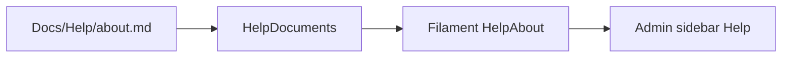

# Admin help — About this app

This pass is the first Help article plus a place in Admin to read it. Page-by-page how-tos (Import CSV, Assign Leads, etc.) come later using the same files and page pattern.

## Naming

The product name in Help/About copy is **OnPoint Marketing’s Lead Booking Application**. Do not use Call Assist.

This pass does **not** rebrand the rest of the app: README title, Filament logo/favicon, repo, Docker paths (`/opt/onpointcall`), and hostnames stay as they are. A full rename can come later.

## Content: [Docs/Help/about.md](../Docs/Help/about.md)

Write a **manager/admin-facing** overview (not the engineering architecture plan). Facts must match what is shipped, not stale README/architecture notes (password invite/login is live; Socialite-only is not).

Opening heading: **About OnPoint Marketing’s Lead Booking Application**.

Outline:

- **What it is** — OnPoint Marketing’s Lead Booking Application. Timeshare-tour calling app that replaces Google Sheets. Goal of each call is to book a tour. The app **never places calls** (agents dial personal phones; TCPA posture).
- **Who uses it** — Admin and Manager use `/admin`. Agents use `/agent`. Calling ability comes from **list assignment**, so a manager assigned to a list also gets the agent workspace.
- **How work flows** — Import CSV into holding → optional queued checks (Soft Score, FCC RND, Salesforce qualification, DNC) → Assign Leads onto a calling list (Standard / TNB) → agent Get Next Lead → disposition / Formstack booking.
- **What it is built in**
  - Laravel 13 / PHP 8.4
  - Filament 4 admin
  - Livewire + Blade + Tailwind agent UI
  - PostgreSQL 16
  - Caddy reverse proxy
  - Laravel database queue + scheduler
  - Email via Laravel Mail (Resend/SMTP in prod; log locally)
- **How it is hosted**
  - Same **Docker Compose** stack locally and in production: `caddy`, `app` (php-fpm), `queue`, `db`
  - Local: Windows + Docker, http://localhost (`/admin`, `/agent`)
  - Production: single VPS, app at `/opt/onpointcall`, deploy GitHub `master` with `scripts/deploy.ps1` (forward migrations only; never wipe the DB)
  - Nightly `pg_dump` to Backblaze B2
- **Integrations** — Soft Score (`prod.onpointapi.com`), Salesforce qualification, FCC Reassigned Numbers, DNC.com, Formstack booking URLs
- Do **not** put seed passwords, SSH IPs, or `.env` secrets in this page

Also add a one-line pointer from [README.md](../README.md) Documentation table to `Docs/Help/about.md` (label it About OnPoint Marketing’s Lead Booking Application). Do not rewrite or retitle the rest of the README.

## Admin UI: Help → About

Add a **Help** nav group (last group, after Administration) in [app/Providers/Filament/AdminPanelProvider.php](../app/Providers/Filament/AdminPanelProvider.php).

New Filament page, same shape as existing custom pages (e.g. [app/Filament/Pages/CallbacksBoard.php](../app/Filament/Pages/CallbacksBoard.php)):

- [app/Filament/Pages/HelpAbout.php](../app/Filament/Pages/HelpAbout.php) — slug `help/about`, label **About**, title **About OnPoint Marketing’s Lead Booking Application**, icon something like `Heroicon::OutlinedQuestionMarkCircle`
- [resources/views/filament/pages/help-about.blade.php](../resources/views/filament/pages/help-about.blade.php) — `x-filament-panels::page` + a section that prints sanitized HTML

Loader so later articles are drop-in markdown files:

```php
// app/Support/Help/HelpDocuments.php
HelpDocuments::html('about'); // Docs/Help/about.md only; allowlisted slug
```

Use Laravel `Str::markdown()` with `html_input: strip` (no new Composer package). Allowlist slugs so a future `{slug}` cannot path-traverse.

Visible to anyone who can open Filament (admin + manager). Agents stay on `/agent` only.



## Tests

Add [tests/Feature/HelpAboutTest.php](../tests/Feature/HelpAboutTest.php):

- Admin (and manager) Livewire test of `HelpAbout` is OK and sees **OnPoint Marketing’s Lead Booking Application**
- HTTP `GET /admin/help/about` is OK for an admin
- Agent cannot open the admin help URL

Use existing `makeAdmin()` / role helpers and `RefreshDatabase`.

## Out of this pass

- How-to pages per admin screen
- Rendering `plans/` or `Docs/API/` in the app
- Agent-workspace help
- Renaming the repo, Filament brand mark, README title, or deploy paths away from OnPoint Call
