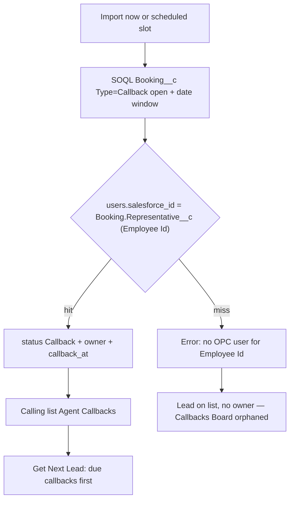

# Booking Callbacks in the dialer

There is **no existing plan** for this. Related but different work:

- [salesforce-booking-import-check.md](salesforce-booking-import-check.md) — exclude CSV leads that already have a Salesforce tour. It does **not** pull field Callbacks into the dialer.
- Personal callbacks already exist (`status = callback`, `callback_owner_id`, Get Next Lead serves due callbacks first). This plan **feeds that path** instead of inventing a second queue.

## Current process

Field OPC agents create Salesforce `Booking__c` records with **Type = Callback** when an in-person guest wants a tour but cannot pick a date/time.

Katie then opens [Callback Report](https://onpointmrg.lightning.force.com/lightning/r/Report/00OKi000000JNIbMAO/view?queryScope=userFolders) (callbacks in the next 30 days), prints or exports it, and hands rows to agents.

Replace that with an on-demand import into OnPoint Call, plus an optional schedule so it can run on its own (for example every morning).

## Confirmed Salesforce shape

Permission set update validated **2026-09-23** against the Connected App (fresh token). Previously hidden fields now query.

| What | Field | Notes |
|------|--------|--------|
| Type | `Type__c` = `Callback` | Picklist: Tour, Package, **Callback**, Mini-Vac. This is the filter Katie means — **not** `Status__c = Agent Callback`. |
| Status | `Status__c` | Open: `New`, `Rescheduled`, `Agent Callback`. Exclude `Cancelled` / `Duplicate` / `Not Interested` / `Not Qualified`. |
| Guest | `First_Name__c`, `Last_Name__c`, `First_Name_2__c`, `Last_Name_2__c`, `Phone__c` / `Phone_Cleaned__c`, `Phone_2__c`, `Email__c`, `Email_2__c`, `Booking_Notes__c` | Last name now readable. |
| Address / demo | `Street__c`, `Unit_Number__c`, `State__c`, `Postal_Code__c`, `Age_Range__c`, `Income__c`, `Gender__c`, `Marital__c`, `HomeOwner_or_Renter__c` | Map onto lead columns / extra_fields. No `City__c` on Booking. |
| Salesforce Lead | `Lead__c` | Optional match to OPC `external_lead_id`. |
| Booking number | `Name` (e.g. `B-43314`) | Store on `leads.booking_id`. Salesforce Id (`a1E…`) is the upsert key. |
| Representative | `Representative__c` | Lookup to **`Employee__c`**. Live: Iranays booking `a0RVr000009zhVtMAI` = her OPC `users.salesforce_id`. |
| Representative name | `Representative_Name__c` | Formula `Representative__r.Name`. |
| Callback date | `Call_Back_Date__c` | Date. Tour date is unused on these rows. |
| Callback time | `Call_Back_Time__c` | Time (timezone-less). API JSON looks like `04:30:00.000Z` — treat as **company-local clock time**, not UTC. Combine with date for `callback_at`. |

Do **not** use the Analytics Report API (integration user has no Run Reports). Replicate with SOQL.

Live counts 2026-09-23 ET, Type=Callback and open status:

- `Call_Back_Date__c` today through +30 days: **3**
- Overdue last 90 days: **29**
- Date null: **15**

Katie’s “next 30 days” print would miss the overdue and dateless rows. Pull overdue (lookback 90 days) as well. Dateless open Callbacks: still insert, set `callback_at` to now (due), and record an error **No callback date**.

### Assignment key

```
Booking.Representative__c  =  Employee__c.Id  =  users.salesforce_id
```

`Employee__c` keyPrefix is `a0R`. There is **no** User lookup on Employee (`User__c` does not exist). `OwnerId` / `CreatedById` are record-owner User Ids (`005…`) and are shared across many employees — do not use them for assignment.

Match `Representative__c` to an **active** OPC user in the same company. Confirmed: Iranays Ferro Employee Id `a0RVr000009zhVtMAI` equals her OPC Salesforce Id.

### Timezone

`Call_Back_Time__c` has no timezone. Combine `Call_Back_Date__c` + time in `CompanyTimezone` (default `America/New_York`) and store UTC. Verify one Katie row (date + displayed time) before treating 4:30 AM as a real calling time.

## Product model

Land each open Callback booking as a **personal callback** on a dedicated list:

- Calling list **Agent Callbacks** (new)
- `leads.status` = `callback`
- `callback_owner_id` = matched agent
- `callback_at` = callback date + time in company TZ
- `booking_id` = Salesforce booking number (`B-43314`)
- `notes` = `Booking_Notes__c` (new lead column — see below)
- Upsert key = Salesforce booking Id (new nullable unique `leads.salesforce_booking_id`, 18-char `a1E…`)

Get Next Lead already serves `callback_owner_id = me` and `callback_at <= now()` **before** the shared pool, but only if the agent is assigned to that lead’s list. Future rows show on the agent’s Callbacks panel and the manager Callbacks Board.



Katie’s report is **next 30 days**. Also pull **overdue still-open** Callbacks (`Call_Back_Date__c < today`, same open statuses, lookback 90 days) so anything that already aged off the printout still gets called.

## On demand and schedule

Katie’s print-and-distribute step becomes an **Import now** action. Hourly hardcoding is not enough — ops must be able to pull immediately **and** set when it runs on its own.

**On demand (required)**

- Filament header action **Import Agent Callbacks** on the Agent Callbacks calling list (managers/admins). Same action can live on Import CSV’s nav group if that is easier to find; the list view is the default home.
- Runs the same sync service as the command (not a second code path). Confirm modal, then a notification with counts.
- Artisan `salesforce:sync-booking-callbacks` (`--dry-run`, `--company=`) for ops/debug.
- If a run is already in progress, refuse a second start and say so.

**Schedule (required)**

Reuse the Report Scheduler shape ([`ReportSchedule`](../app/Models/ReportSchedule.php) / [`Weekdays`](../app/Support/Weekdays.php)), not a new scheduler framework:

- Enabled toggle
- Days of week (multi-select)
- One or more times (minutes, no seconds)
- Company timezone from App Settings (`dashboard_email_timezone`)
- `last_run_slot` so the same minute cannot fire twice

Default seed: enabled, all 7 days, `07:00` local — so Katie’s morning print is replaced without a manual click. She can add more times (e.g. noon) or turn the schedule off and only use Import now.

Cron: one command on the existing `schedule:run` every-minute loop in [`bootstrap/app.php`](../bootstrap/app.php). If today/time match, dispatch the same job as Import now.

Store last-run summary on the list (or a small `booking_callback_sync_runs` table): started/finished, created, updated, closed, skipped, **error count**, and the error rows.

## Unmatched agent errors

A Callback that cannot be mapped to an **active** OPC user via **`Booking.Representative__c` = `users.salesforce_id`** (Employee Id) is an **error**, not a quiet skip.

Treat as errors:

- Blank `Representative__c`
- That Employee Id matches no user in this company
- User exists but is inactive
- Open booking with blank `Call_Back_Date__c` (still insert as due)

Still **insert/update the lead** on Agent Callbacks with `callback_owner_id` null when the agent is missing, so the guest is not dropped. It shows on Callbacks Board as orphaned for reassignment. The error is what tells Katie/ops to put the Employee Id on the OPC user (or invite the agent).

Show the errors:

1. **Import now** — danger notification: `N agent match errors` plus the first few booking numbers / representative names. Link to the error list.
2. **Last-run error table** on the Agent Callbacks list (same idea as import skipped rows): booking number, Salesforce booking Id, representative name, Employee Id, reason (`No representative on booking` / `No user with this Salesforce Id` / `User inactive` / `No callback date`).
3. Scheduled runs write the same rows; last-run badge/count stays visible until the next run (or until errors are zero).

Do not name-match as a fallback. Set the OPC user’s Salesforce Id to the Employee Id (`a0R…`) and Import now again — the upsert will attach the owner.

## List, type, and assignments

- Seed calling list **Agent Callbacks** if missing: Standard cadence, `lead_type = standard` so the existing booking URL/param map works when they convert the callback to a tour.
- Copy `booking_url_template` / `booking_param_map` from the Standard list at seed time.
- **Auto-assign** the matched agent to Agent Callbacks (`ListAssignment` upsert). Do not assign every agent up front — if a callback later becomes `callable` (No Answer / skip), only people on that list could take it; start with owners only. Managers can add more agents on List Assignments if they want coverage.
- Invite / agent-import later: optional checkbox or always-on “also assign Agent Callbacks” can wait; sync will add the assignment when a booking matches.

Cadence does not gate due callbacks (legal window + blackouts still do). The list still needs a cadence for the rare case a row returns to the pool.

## Upsert and phone uniqueness

`leads` is unique on `(company_id, phone)`. A second row for the same guest is not allowed.

| Incoming booking | Action |
|------------------|--------|
| New `salesforce_booking_id` and new phone | Insert callback lead on Agent Callbacks |
| Same `salesforce_booking_id` already in OPC | Update name/phone/email/notes, `callback_at`, owner, list; **do not** reset attempt history or steal a live claim |
| Phone exists, different/no booking id, status Callable / Callback / Holding | Attach this callback to that lead (set booking id, move to Agent Callbacks, owner + `callback_at`) |
| Phone exists and status DNC / Booked / Terminal | Skip; count as skipped. Do not reopen DNC. |
| No usable 10-digit phone | Skip |

When Salesforce status leaves the open set (`Cancelled`, `Duplicate`, …) and the local lead is still `callback` **and** still tagged with that booking id: set `terminal` (or a dedicated closed status if we add one later), clear owner. Do **not** delete. Do **not** touch the lead if an agent already booked or DNCd it in OPC.

Skip Soft Score / RND / qualification / DNC **on ingest**. These people were just spoken to in person. Legal calling hours still apply at dial time.

## Booking notes → lead notes

There is no lead-level notes column today (call notes live only on history payloads). Field agents type `Booking_Notes__c` (examples already in SF: “125 go”, “Wyn getting married 2months”, “Navy”). That text must land on the lead where the dialer agent can see it — not only in `extra_fields`.

- Add nullable text `leads.notes`.
- On insert and on same-booking update: copy `Booking_Notes__c` → `leads.notes` (trim; blank SF notes leave the column null / unchanged if already set).
- Show **Notes** on the agent workspace with the other lead context (not buried in extra fields), and on the admin lead form / infolist as a textarea.
- Also put the same text on the `BookingCallbackSync` history row so Call History has it.
- Disposition notes stay on history; do not merge them into `leads.notes`.

Salesforce remains the source for this field on Agent Callbacks syncs. If an OPC agent edits `notes` in admin, the next import of that booking will overwrite it.

## Sync mechanics

Closest patterns: [`SalesforceBookingClient`](app/Services/Salesforce/SalesforceBookingClient.php) + [`SalesforceCreditCardTypeSyncService`](app/Services/Salesforce/SalesforceCreditCardTypeSyncService.php) / `salesforce:sync-credit-card-type`.

- Config block `services.salesforce.booking_callbacks` (Booking field map including `Representative__c`, `Call_Back_Date__c`, `Call_Back_Time__c`, open statuses, horizon days, overdue lookback).
- `SalesforceBookingCallbackClient` — paged SOQL on `Booking__c` (reuse `SalesforceClient::query`). Relationship `Representative__r.Name` is enough; match uses the Id on the booking.
- `BookingCallbackSyncService` — `Representative__c` → OPC user, upsert leads, list-assign, history.
- Command `salesforce:sync-booking-callbacks` (`--dry-run`, `--company=`).
- One job shared by **Import now** and the day/time schedule. Not a hardcoded hourly cron.
- Last-run counts: created, updated, skipped no-phone, skipped DNC/terminal, closed, **agent match errors**.

History: new `LeadHistoryType::BookingCallbackSync` with Salesforce booking Id, Employee Id (`Representative__c`), callback_at, and the booking notes.

Do not store `Booking_Notes__c` only in `extra_fields`.

Timezone: `CompanyTimezone` when combining date + time into `callback_at` (UTC in DB).

## Out of this pass

- Pushing OPC dispositions back onto `Booking__c` (status / tour conversion).
- Running or cloning the Salesforce report itself.
- CSV fallback for Katie.
- Name-only agent matching.
- A new lead type (`agent_callback`) unless Assign/Qualify start mixing these with Standard — list name should be enough.

## Tests

Http-fake Salesforce like [`tests/Feature/BookingCheckTest.php`](tests/Feature/BookingCheckTest.php):

- Type Callback + open status + date in window → `Representative__c` matches `users.salesforce_id` → inserted on Agent Callbacks, owner set
- `Booking_Notes__c` copies to `leads.notes` and is visible on the agent panel; blank notes stay null
- Same booking Id with changed notes → `leads.notes` updates
- Blank representative / no OPC user / inactive user → lead still inserted unmatched **and** an error row is recorded; Import now notification is danger
- Blank `Call_Back_Date__c` → inserted as due + error `No callback date`
- Same booking Id on second sync after the user Salesforce Id is set to the Employee Id → owner attached, error gone
- Same booking Id on second sync → update `callback_at` / owner, no second phone row
- Existing callable phone → attached, not inserted
- DNC phone → skipped
- Status Cancelled on later sync → local callback closed
- Date outside window and not overdue → not pulled
- Matched agent receives a List Assignment to Agent Callbacks
- Import now and a matching schedule slot both call the same service
- Overlapping run is refused
- Dry-run writes nothing
