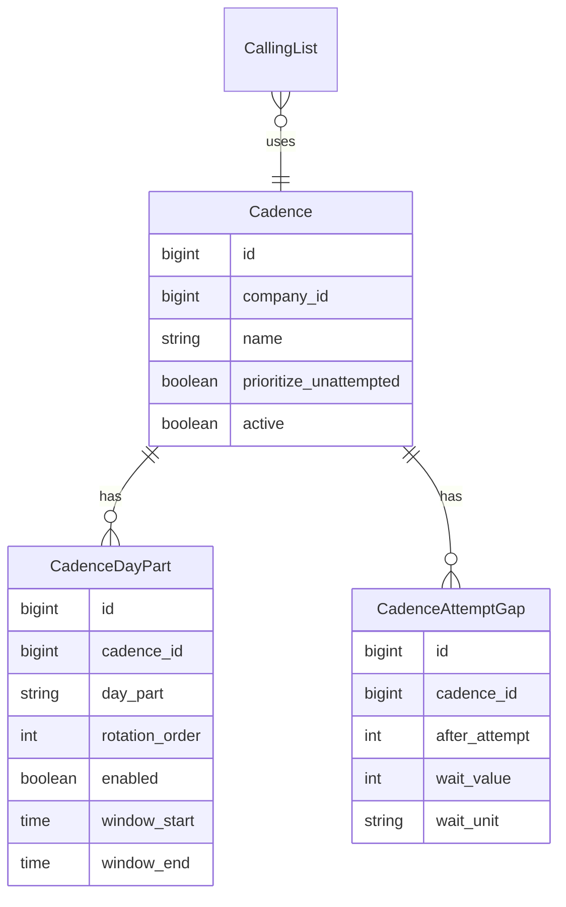

# Standalone Cadence resource

## Problem

Cadence is embedded as JSON on each Calling List, which makes it:
- Hard to understand and configure (raw JSON / multi-select)
- Impossible to reuse the same rhythm across multiple lists
- No queue priority (never-dialed first)
- Only a **flat** `min_gap_minutes` between attempts — no rules like "after 4 attempts, wait 7 days"

## Goal

Cadence becomes a **first-class, reusable record** with **normalized child tables**. Calling Lists only **pick** a cadence by name.

## Locked decisions

- **Storage:** relational tables, not a JSON blob on `cadences`.
- **Fresh-first:** `prioritize_unattempted` means `attempt_count = 0` before retried leads.
- **Attempt gaps:** apply after **any** disposition that increments `attempt_count` (Skip excluded).
- **Callbacks:** due callbacks **skip day-part and attempt-gap**. Legal hours, weekdays, and blackouts still apply. Align [`NextLeadService`](app/Services/Leads/NextLeadService.php) with [`LeadLookupService::canWorkImmediately()`](app/Services/Leads/LeadLookupService.php), which already skips cadence for owned callbacks.
- **Wait units:**
  - `minutes` / `hours` — elapsed duration from `last_attempt_at`
  - `days` — **lead-local calendar days**: take the local date of `last_attempt_at`, add `wait_value` days, eligible from **local midnight** that morning. Legal window is a separate check, so the first legal slot that day is when agents actually get the lead.

Example: last attempt Monday Aug 10 2:00 PM lead-local, wait 7 days → eligible from Monday Aug 17 00:00 lead-local; still blocked until that day's state window (typically 8:00 AM).

## Data model



### `cadences`

| Column | Type | Notes |
|--------|------|-------|
| `id` | bigint | PK |
| `company_id` | FK | tenant scoped |
| `name` | string | unique per company |
| `prioritize_unattempted` | boolean | default true |
| `active` | boolean | hide from **new** picker assignments when inactive |
| `timestamps` | | |

### `cadence_day_parts`

| Column | Type | Notes |
|--------|------|-------|
| `id` | bigint | PK |
| `cadence_id` | FK | cascade delete |
| `day_part` | string | `morning`, `afternoon`, `evening` |
| `rotation_order` | unsigned tinyint | drag order in admin |
| `enabled` | boolean | in rotation? |
| `window_start` | time | lead-local start |
| `window_end` | time | lead-local end |
| `timestamps` | | |

Unique: `(cadence_id, day_part)`. Exactly **3 rows** per cadence, created with the parent. Form is not addable/deletable.

### `cadence_attempt_gaps`

| Column | Type | Notes |
|--------|------|-------|
| `id` | bigint | PK |
| `cadence_id` | FK | cascade delete |
| `after_attempt` | unsigned smallint | threshold ≥ 1 |
| `wait_value` | unsigned int | e.g. 7 |
| `wait_unit` | string | `minutes`, `hours`, `days` (PHP enum) |
| `timestamps` | | |

Unique: `(cadence_id, after_attempt)`. At least one row required. Seed must include `after_attempt = 1` so early attempts are not wait-free by accident.

If no rule matches (`attempt_count` below every threshold): **no extra wait** (day-part still applies). That is why seed includes an attempt-1 rule.

### Change `calling_lists`

- Add `cadence_id` FK → `cadences.id`, **NOT NULL** after backfill, `ON DELETE RESTRICT`
- Remove `cadence` jsonb column (relationship will occupy the `cadence()` name)
- Keep `max_attempts_override` on the list (hard ceiling, not a wait)

Inactive cadences remain valid for already-assigned lists; they just cannot be newly selected.

### Migration from inline JSON

1. Create the three tables
2. Per company, group lists by identical cadence JSON; create one Cadence + children per distinct blob (name `Migrated cadence N` if names collide); map `min_gap_minutes` → gap `{ after_attempt: 1, wait_value: N, wait_unit: minutes }`
3. Set `calling_lists.cadence_id`
4. Drop `calling_lists.cadence`

Also seed named **Standard** / **Aggressive** if those names are free:

| Cadence | day parts | attempt gaps | prioritize_unattempted |
|---------|-----------|--------------|------------------------|
| **Standard** | all 3 enabled, default hours | 1→60 min, 4→7 days | true |
| **Aggressive** | morning + evening | 1→30 min, 3→3 days | true |

[`DatabaseSeeder`](database/seeders/DatabaseSeeder.php) must call Cadence seeder **before** [`CallingListSeeder`](database/seeders/CallingListSeeder.php).

## Runtime

### Callbacks vs pool

[`ComplianceService::canDialNow()`](app/Services/Compliance/ComplianceService.php) today always ANDs `isCadenceReady()`. Change:

- `Callback` status: legal window + blackout only (no day-part, no attempt gap)
- `Callable` status: legal window + day-part + attempt gap

[`NextLeadService::tryClaimFromCandidates()`](app/Services/Leads/NextLeadService.php) uses `canDialNow` for both callbacks and pool, so this one change covers both paths.

### Attempt gap

[`AttemptGapResolver`](app/Services/Compliance/AttemptGapResolver.php):

1. Highest `after_attempt` where `lead.attempt_count >= after_attempt`
2. Minutes/hours: `last_attempt_at + duration`
3. Days: `last_attempt_at` in lead TZ → local date + `wait_value` days → that date at `00:00` lead TZ
4. No `last_attempt_at`: satisfied
5. No matching rule: satisfied

### Day parts

[`DayPartResolver`](app/Services/Compliance/DayPartResolver.php) reads enabled `cadence_day_parts` ordered by `rotation_order`.

**Orphan `next_day_part`:** if the stored value is missing from the enabled rotation (cadence edited), treat as unmatched and fall through to the first enabled part for **serving** (`matchesNextDayPart` true when current part equals first enabled, **or** treat null-like: eligible in any enabled part). Implementation: if `next_day_part` is not in `dayPartsFor()`, behave as `null` (any enabled part). Next No Answer / Left VM then writes a valid part via `advanceDayPart`.

**Overlapping windows:** reject on save if enabled windows overlap. `currentDayPart` first-match is undefined if they overlap.

### Queue priority (mixed lists)

Agents can be assigned to multiple lists with different `prioritize_unattempted` flags. SQL:

```sql
ORDER BY
  CASE WHEN cadences.prioritize_unattempted THEN leads.attempt_count ELSE 0 END ASC,
  leads.queue_rank ASC,
  leads.imported_at ASC
```

Join `calling_lists` → `cadences`. Lists with the flag off do not float never-dialed leads above everyone else; lists with the flag on still do within the mixed pool.

### Candidate window (existing bug, worse with 7-day gaps)

[`poolCandidates()`](app/Services/Leads/NextLeadService.php) currently `limit(50)` **before** PHP `canDialNow` / cadence filters. After long cooldowns, the first 50 by rank may all be ineligible while later rows are ready.

v1: increase the fetch window (e.g. 250) **and** apply attempt-gap + day-part in the query where practical (`last_attempt_at` vs computed eligible_at is harder for day-part; at least filter exhausted and obviously-not-yet-eligible by a conservative `last_attempt_at` bound). Add a test that an eligible lead beyond the old 50-row slice is still served.

Eager-load `callingList.cadence.dayParts` and `callingList.cadence.attemptGaps` on every serving path that currently does `with('callingList')`.

## Admin UI

### Cadence resource (Configuration → Cadences)

Same group as Lead Types. Fields: name, active, prioritize never-dialed.

**Day parts** — relationship repeater, `addable(false)`, `deletable(false)`, reorderable:

| Day part (read-only) | In rotation | Start | End |

Helper: rotation preview from enabled rows in table order.

**Attempt wait rules** — relationship repeater:

| After attempt # | Wait | Unit |

Validation: at least one enabled day part; at least one gap rule; unique `after_attempt`; `window_start < window_end`; no overlapping enabled windows.

Delete cadence: blocked while any calling list references it (`RESTRICT` + Filament notification).

### Calling List record

- Required `Select::make('cadence_id')` of **active** cadences; inactive still shown if it is the current value
- `cadence.name` column on the index table
- Keep `max_attempts_override`

## Settings history

[`RecordsSettingsChanges`](app/Models/Concerns/RecordsSettingsChanges.php) only snapshots the parent model. Child row edits would otherwise be invisible.

On Cadence create/update (and after relationship save), record `before`/`after` including `dayParts` and `attemptGaps` collections (ids + attributes), not only parent columns.

## Tests

- `AttemptGapResolverTest` — 60 min after 1; calendar 7 days after 4 (DST-safe local date); no rule → no wait
- `DayPartResolverTest` — rotation from enabled rows; orphan `next_day_part` treated as any-enabled
- `ComplianceServiceTest` — callable requires gap + day-part; **callback does not**
- `NextLeadServiceTest` — prioritize_unattempted mixed lists; callback served despite pending gap; eligible lead beyond first 50
- Migration backfill from inline JSON
- Replace every `'cadence' => [...]` CallingList create with a Cadence + `cadence_id`

## Review gaps (closed in this revision)

These were missing from the earlier draft and are now in-scope:

1. Callbacks still hit `isCadenceReady()` today — contradicts “callbacks override cadence”
2. `days` unit was unspecified (elapsed vs calendar)
3. Mixed-list `ORDER BY attempt_count` would ignore per-list flag
4. `limit(50)` before cadence filter starves the queue once 7-day rules exist
5. Orphan `next_day_part` after editing rotation
6. Missing attempt-1 gap ⇒ wait-free early attempts
7. Seeder order / required `cadence_id` chicken-egg
8. Unique cadence name per company
9. Settings history would miss child-table edits
10. Day-part window overlap
11. N+1: `with('callingList')` does not load cadence children
12. `ON DELETE RESTRICT` vs cascade wiping lists
13. Inactive cadence still applied at runtime for assigned lists (intentional)

## Out of scope

- Newest-import-first as a separate sort key
- Per-list cadence overrides
- Different gaps per disposition
- Moving `max_attempts` onto Cadence (stays App Settings / list override)
- Distinguishing empty-queue day-part vs cooldown messages (optional later)
- Fixing `booking_param_map` `[object Object]`

## Result

Managers define **Standard** / **Aggressive** cadences as real records with day-part rows and attempt-gap rows. Lists pick one. Serving enforces day-part rotation, elapsed or calendar-day waits, never-dialed-first where flagged, and due callbacks on legal hours only.
