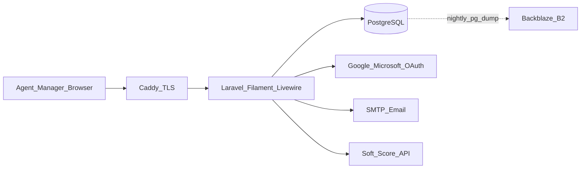
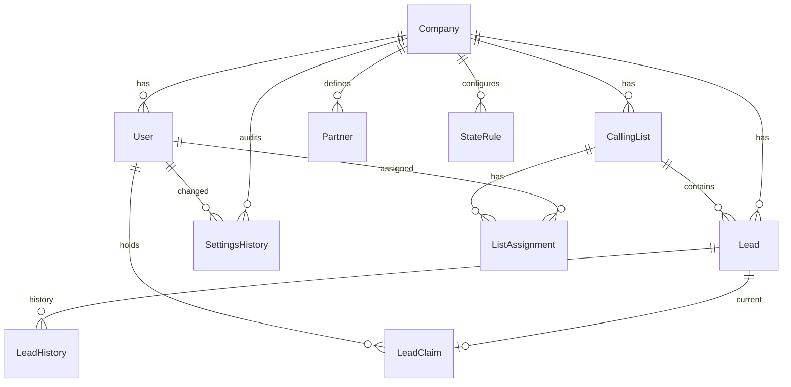

# Call Center Application — Architecture Proposal

Sources of truth for this plan:

- [Docs/REQUIREMENTS_chatgpt.md](../Docs/REQUIREMENTS_chatgpt.md) (requirements input; architecture wins on conflict)
- Owner clarifications (override chatgpt where they conflict — see locked decisions)

## Decisions locked from owner answers

| Topic | Decision |
|---|---|
| Next-lead priority | Due/overdue **callbacks always first**, then shared pool |
| Callback scheduling | Must fall inside lead’s legal window; **reject + notify** otherwise |
| Undo | **Removed** (chatgpt §7 asks for ~10 min undo — **do not implement**) |
| List membership | Lead in **at most one** calling list at a time |
| Attempts | No Answer / Left VM / Callback / Booked increment; Skip does not; terminal outcomes increment and end |
| Recycle | Reset attempt count, keep full history, add **Recycle** history row, stay on **same calling list**, make callable again |
| Lookup | Find any lead; show last disposition; **completed/terminal visually obvious** |
| State windows | **Admin-only**; seed FL/NY/NJ (and federal default) |
| Hosting | Single **VPS** |
| Migration | Leads + **last disposition** + **last owner** only (chatgpt asks for full history — slim migration wins for v1) |
| Partners | **`partner_list` comma-separated field on the lead** (preserve source string); display + manager filter; admin **partner definitions** to interpret known names |
| Booking form | Company **default** URL template in `app_settings`; **per calling list override** (TNB uses a different Formstack URL + param map) |
| Lead types | **Standard** and **TNB** (Tour No Buys). TNB modeled as its **own calling list(s)**; agent eligibility via list assignment; same lifecycle otherwise |
| Copy / PII | **Phone number only** may be copied; all other customer fields get copy friction |
| Import dedupe | Match on **`external_lead_id` or phone**; on match **ignore** the row (no update to existing lead) |
| Multi-tenant | **`company_id` on every table** (except `companies`); v1 = one company; designed to sell/rent isolated client floors later |
| Daily dashboard email | Every day, email a **prior-day dashboard summary** to a configurable **recipient group**; company-scoped |
| Stack | **Laravel + Filament + PostgreSQL** (switched from Next.js for lead-management, filtering, import/export, jobs/APIs) |
| UI kit | **Filament** for manager/admin consistency; **Tailwind + Livewire/Blade** for the agent calling workspace |
| Soft Score | Call [Docs/SoftScore/soft-score-api.md](Docs/SoftScore/soft-score-api.md): **agent can run a check** on a lead; **optional batch** soft-score on import (queued) |

## Adopted from REQUIREMENTS_chatgpt (now in plan)

- Freshness = **import date/time** when releasing N freshest.
- Lead **lease / claim = 20 minutes**; expired lease returns lead to shared availability **unless** it is an agent-owned callback (callback ownership unchanged).
- No permanent agent owner except callbacks; after normal attempts any eligible list agent may get the lead.
- **Skip → bottom of that calling list’s queue** (not random re-draw); does not count as an attempt.
- Callback ownership persists until resolved or a **manager reassigns**; unavailable agent → callback waits (except deactivation handling below).
- **Lead searches are not logged** (no search audit rows; manager activity = calls, outcomes, skip rates only).
- Manager **bulk ops**: recycle, mark DNC, move between lists, **merge duplicates**; bulk partner-eligibility edits excluded.
- Multi-tenant foreshadow for **selling or renting the software to clients**: every table except `companies` itself carries **`company_id` from v1**. Full data isolation per company is a schema + query invariant (all reads/writes scoped by `company_id`); do not build billing, client onboarding UI, or cross-company admin yet.
- Admin **§13 configuration** surface: state windows (times + weekdays + holidays/blackouts), ZIP/address-first TZ, manual-dial states, max attempts, per-list cadence, **default + per-list booking URL/param maps**, allowlist, lists/assignments (incl. TNB lists), partner definitions, CSV import mappings (incl. lead type), blackout calendars, **daily dashboard email (recipients, send time, enabled)**. DNC permanence and no-telephony are **code invariants**, not toggles. **Every settings write appends to `settings_history` (who/when/before/after).**
- **Lead types — Standard vs TNB:** Same dispositions, cadence, TCPA, callbacks. Differences: (1) only agents assigned to TNB list(s) get TNB leads; (2) TNB booking form URL/params differ. Implement TNB as **calling list(s) with `lead_type = tnb`**, not a separate auth system.
- **Daily dashboard email:** cron job once per day per company; HTML summary of the **prior calendar day’s** manager dashboard metrics emailed to a configured group.

**Operational defaults:**

- **Multi-list agents** → one merged “Get next lead” across assigned lists (callbacks first globally for that agent).
- **User deactivation** → kill sessions; release active leases to pool; **orphaned callbacks stay `callback` status and appear on the manager callbacks board for explicit reassignment** (do not auto-dump into shared callable pool).

---

## Recommended stack (KISS + cost)

**Single VPS, Docker Compose: Laravel app + Postgres + Caddy.**

| Layer | Choice | Why |
|---|---|---|
| App | **Laravel 11+ (PHP 8.3)** | Best fit for lead management, filters, CSV import/export, queues, scheduler, future Salesforce; lighter ops than Node for this workload |
| Admin / manager UI | **Filament** | Consistent modern forms/tables/filters/bulk actions without building a design system from scratch |
| Agent UI | **Blade + Livewire + Tailwind** | Simple calling workspace; phone-first layout; same auth/session as Filament |
| DB | **PostgreSQL 16** on same VPS | `FOR UPDATE SKIP LOCKED` lead leases; relational history; per-company uniques |
| Auth | **Laravel Socialite** — Google + Microsoft OAuth only | No passwords; allowlist by email; session auth |
| Jobs / cron | **Laravel queues + scheduler** | Imports, daily dashboard email, lease cleanup; database queue driver in v1 (no Redis required) |
| Reverse proxy / TLS | **Caddy** | Automatic HTTPS |
| Backups | Nightly `pg_dump` → **Backblaze B2** | Off-box; fits ~$10–20/mo |
| Live dashboard | **Livewire polling (5–10s)** or Filament widgets | Simple; no Redis/websockets required at this scale |
| Email | **Laravel Mail + SMTP** (Resend/SES/any SMTP) | Daily digests |
| Soft Score API | **Laravel HTTP client** → `prod.onpointapi.com` (OAuth client credentials) | Agent on-demand check + optional import batch; secrets in env / encrypted settings only |

**Not chosen:** Next.js/React SPA stack (heavier for CRUD/admin growth); dialer/telephony; Redis/Kafka/microservices for v1; per-seat SaaS; native apps; storing Soft Score secrets in git.

**Rough monthly cost:** VPS $6–12 + B2 &lt; $2 + cheap SMTP → under $20, often near $10.

---

## High-level architecture

- **One Laravel app** (php-fpm or Octane later if needed; start with php-fpm + Caddy).
- **Filament panels:** Manager + Admin resources (leads, holding release, lists, imports, users, state rules, settings history, dashboard widgets). Agent does **not** live primarily in Filament — dedicated Livewire “Get next lead” workspace for speed/clarity.
- **Server-enforced compliance** in `App\Services\Compliance\ComplianceService`: legal hours (weekdays/blackouts), manual-dial states, DNC, attempt caps, TZ resolution. Policies/gates enforce roles; UI is never the sole gate.
- **Soft Score** in `App\Services\SoftScore\SoftScoreClient`: OAuth token (cached until `expires_in`), POST `/marketing/v1/leads/softscore`, map lead → API payload, persist `qualificationCode`. Failures are recorded; they do **not** invent a score.
- **Roles:** `admin` | `manager` | `agent` via Laravel policies / Filament shields-or-simple role column. Calling UI when user has ≥1 list assignment.
- **`company_id` on every table** (except `companies`). Global Eloquent scope (or tenancy trait) applied to all models; session user resolves company — never trust client-supplied company alone.
- **CSV** is the only v1 intake; Soft Score + future Salesforce via HTTP. Formstack remains URL handoff.
- **Scheduler:** `dashboard:email-digest`, backup hook, expire-stale-claims — `php artisan schedule:run` via host cron.

---

## Data model (core)

**Key tables** (all non-root tables include `company_id` + index; unique constraints are per-company, e.g. `(company_id, external_lead_id)`, `(company_id, phone)` where enforced)

- `companies` — tenant root (id, name, active); v1 seeds one row; future sell/rent = one row per client
- `users` — email, role, `active`, OAuth subject ids; `company_id`
- `allowed_emails` — admin allowlist; `company_id`
- `leads` — phone, name, address/city/state/zip, email, demographics, venue/event, `external_lead_id`, consent tokens, `timezone`, `status`, `attempt_count`, `next_day_part`, `last_attempt_at`, `callback_at`, `callback_owner_id`, `calling_list_id` (null while holding), `imported_at` / batch refs, **`partner_list`**, `queue_rank`, **`lead_type`**, **`extra_fields` jsonb**, soft-score fields: **`soft_score_code`** (qualificationCode), **`soft_score_status`** (`null` \| `pending` \| `qualified` \| `not_qualified` \| `error`), **`soft_score_checked_at`**, **`soft_score_last_error`**; `company_id`
- `partners` — admin-defined partner codes/names; `company_id`
- `import_batches` — source filename, imported_at, counts, duplicate skips, **`lead_type`**, **`run_soft_score`** bool, soft-score job progress counts; `company_id`
- `import_mappings` — named CSV column layouts, optional default **`lead_type`**; `company_id`
- `calling_lists` — name, **`lead_type`** (`standard` | `tnb`), cadence, optional max-attempts override, active, **`booking_url_template`**, **`booking_param_map`**; `company_id`
- `list_assignments` — user ↔ list; `company_id`
- `lead_claims` — lease: `lead_id`, `user_id`, `claimed_at`, `expires_at`; `company_id`
- `lead_history` — append-only attempt/disposition/skip/assign/release/recycle/merge/claim/claim_expire/status change/**soft_score**; **not** searches; `actor_id`, `at`, payload JSON; `company_id`
- `state_rules` — `state_code`, window start/end, permitted weekdays, `manual_dial_only`; `company_id`
- `blackout_dates` — holidays/blackouts; `company_id`
- `app_settings` — default booking templates/maps, max attempts, claim TTL, dashboard email knobs, **`soft_score_originator`** (configurable; Salesforce uses `KALEO`), Soft Score base URL for stage/prod; `company_id`
- `dashboard_email_recipients` — email addresses in the daily digest group; `company_id`
- `settings_history` — append-only config audit; `company_id`

**Lead `status`:** `holding` | `callable` | `callback` | `booked` | `terminal` | `dnc`

---

## Key workflows / algorithms

### A. Import → holding → release

1. CSV import (mapping from `import_mappings` + **lead-type selector or mapping default**):
   - Set `lead_type` from import UI selector or `import_mappings.lead_type` (required). Batch is typed Standard or TNB.
   - Optional checkbox: **Run Soft Score on import** → stored on `import_batches.run_soft_score`.
   - Normalize phone to 10 digits; preserve raw `partner_list`; map TNB-only columns into `extra_fields` / known columns; resolve TZ (ZIP/address → state fallback).
   - **Dedupe:** if `external_lead_id` **or** phone matches an existing lead in the company → **ignore row** (no field updates); count as duplicate in batch report.
   - Else insert → `holding`, set `imported_at` + `lead_type`.
   - Lead-ID match to A but phone match to B → ignore; flag conflict in import report.
   - If `run_soft_score`: after successful inserts, dispatch queued **`SoftScoreLeadJob`** per new lead (rate-limited / chunked). Import completes without waiting on API; batch report shows scored / pending / error counts as jobs finish.
2. Manager holding query: filter by **`lead_type`**, soft-score status/code, state, venue, event, source file, batch/date, zip, partner; show count; release **all** or **N freshest by `imported_at`** into exactly one calling list.
   - **Hard rule:** target list’s `lead_type` must equal the leads’ `lead_type`. On release, keep/confirm denormalized `lead_type` on the lead.
3. List moves: only to another list of the **same** `lead_type`. Recycle / merge = explicit manager (or bulk) actions only.

### A2. Booking URL construction (Standard + TNB)

1. Resolve template: `calling_lists.booking_url_template` if set → else `app_settings.booking_url_template`.
2. Resolve param map: list `booking_param_map` if set → else app default map (Standard default = lead ID only).
3. Build query string from map `{ form_param: lead_field }`. **Empty/null map ⇒ lead ID only** (safe before TNB Formstack param names are confirmed).
4. Open external Formstack; no in-app booking form.

### A3. Soft Score (agent + import batch)

Per [Docs/SoftScore/soft-score-api.md](Docs/SoftScore/soft-score-api.md):

1. **Auth:** POST `/oauth/v2/accesstoken?grant_type=client_credentials` with `client_id` / `client_secret` from **env / encrypted company secrets** (never git). Cache Bearer token until near `expires_in`.
2. **Score:** POST `/marketing/v1/leads/softscore` with `Authorization`, `Content-Type: application/json`, `X-ORIGINATOR-APPLICATION` from settings. Body maps lead → `leadRequest` (phone digits-only / strip leading 1; zip first 5; state 2-letter; `country: USA`; `ownerFlag: N`; letter inds `N`).
3. **Success:** read `lead.creditScore[0].creditBand.qualificationCode`. Non-blank → `soft_score_status = qualified`, store code. Blank → `not_qualified`. HTTP/network/parse failure → `error` + `soft_score_last_error`.
4. **Agent:** on lead workspace, **Run Soft Score** button (sets `pending`, calls API, shows code/status). Append `lead_history` type `soft_score` with actor/when/result. Does not place a call; not a TCPA dialer.
5. **Import batch:** optional; same client path via queue jobs. Managers can re-run soft score from Filament on selected leads later.
6. Soft Score does **not** gate get-next-lead in v1 unless later configured; it is informational for pitch/booking.

### B. Get next lead (§5 + §6 + §7)

Single DB transaction:

1. **Expire leases** where `expires_at < now()`: delete claim; if lead is **not** an owned callback, it is available again; if it **is** a callback, ownership/schedule unchanged (only the lease ends).
2. **Callbacks first** for this user: `status = callback`, `callback_owner_id = user`, `callback_at <= now()`, user assigned to lead’s list, now inside legal window (state rule + weekdays + not blacked out). Most overdue first. `FOR UPDATE SKIP LOCKED` → lease 20m → return.
3. Else **shared pool** on assigned lists: `status = callable`, no active claim, `attempt_count < max`, in legal window, day-part matches `next_day_part`, min gap since `last_attempt_at`, order by **`queue_rank` ascending then `imported_at`**. Lease 20m.
4. Empty → explain whether blocked by hours, cadence, or none.

### C. Disposition

| Outcome | Effects |
|---|---|
| Booked | `booked`; attempt++; history; clear lease; scoreboard++ |
| Callback | reject if outside legal window; else `callback`, owner=self, attempt++; clear lease |
| No Answer / Left VM | attempt++; advance day-part; stay `callable`; clear owner; clear lease |
| Not Interested / Not Qualified / Bad Number / Wrong Number | attempt++; `terminal`; clear lease |
| DNC | attempt++; `dnc`; never selectable; clear lease |
| Skip | history + reason; **no** attempt++; clear lease; **bump to bottom of list queue** (`queue_rank = max+1`) |

Disposition labels match the spreadsheet: Booked, Callback, No Answer, Left VM, Not Interested, Not Qualified, DNC, Bad Number, Wrong Number (+ Skip as a non-disposition utility).

**No undo.**

### D. Recycle / bulk / merge (manager)

- Recycle: reset `attempt_count` and cadence; keep history + recycle row; **same calling list**; `callable`. Never recycle `dnc`.
- Bulk: recycle, mark DNC, move lists, merge duplicates. No bulk partner-list edits.
- Merge duplicates: survive one lead; fold history; drop or redirect the other; history row records merge.

### E. Compliance presentation

- Desktop: large phone; **click copies phone only**; never `tel:` on desktop.
- Mobile: `tel:` only if not `manual_dial_only` (FL true by default).
- Copy friction on all other customer fields; no agent PII CSV export.
- Server never returns a callable lease outside legal hours / blackouts.

### F. Lookup (§8)

- Min query length; no blank/wildcard-all; result cap (~10).
- **Do not log searches.**
- Show last disposition; terminal/booked/dnc strongly bannered read-only.
- Available lead → may lease and work now; other-agent callback or terminal → read-only.

### G. Deactivate user

- `active=false`; revoke sessions; delete leases (non-callback leads return to pool).
- Callbacks owned by that user remain `callback` and show on manager board as **needs reassignment** until a manager reassigns.

### H. Daily dashboard email

- Cron (host or container) runs once daily per company at `dashboard_email_send_time` in `dashboard_email_timezone`.
- If `dashboard_email_enabled` and ≥1 recipient: build HTML digest for the **previous local calendar day**:
  - Totals: bookings, calls/attempts, outcome breakdown, skips
  - Per-agent table: calls, bookings, callbacks pending, skip count
  - Overdue callbacks count (as of send time)
  - Optional split by Standard vs TNB if both lists are active
- Send one email to the **recipient group** (BCC or To-all — use BCC to avoid leaking addresses across external stakeholders if the group mixes roles).
- Log send success/failure (simple `lead_history`-style ops log or mail log table scoped by `company_id`); do not block the app if mail fails — alert via log.
- Recipient list and schedule changes go through admin settings → `settings_history`.

---

## State rules + TZ seed

- Default all states: 08:00–21:00 local, all weekdays permitted unless configured, `manual_dial_only = false`.
- FL: `manual_dial_only = true`; NY/NJ seeded 08:00–21:00.
- Blackout/holiday calendar admin-managed.
- TZ: prefer ZIP/address geo; fall back to state centroid/representative zone.

---

## App surfaces (v1)

**Agent (Livewire):** Get next lead; lead workspace with **Run Soft Score** + displayed code/status; booking link; personal callbacks; scoreboard + leaderboard; guarded lookup; phone-only copy.

**Manager (Filament):** CSV import with lead-type + optional **Run Soft Score on import** + batch report (incl. score progress); holding filters incl. soft-score; release; lists; recycle; bulk DNC/move/merge; bulk soft-score re-run; dashboards; callbacks board.

**Admin (Filament):** allowlist/roles; state rules; booking defaults; Soft Score originator/base URL (secrets via env); dashboard email; settings history.

---

## Migration (spreadsheet → app)

Owner-scoped v1: upsert/import leads; map **last disposition** + **last owner** into status + one synthetic `lead_history` row; place in holding unless a target list is chosen. Full multi-attempt history out of scope for the one-time migration (can be added later if exports allow).

---

## Backups & ops

- Nightly `pg_dump -Fc` → B2; retain 30 days; documented restore + smoke checklist.
- Compose: `caddy`, `app` (php-fpm + artisan), `db`; optional `queue` worker container (or `queue:work` in same app image).
- Health route; optional free uptime ping.
- Host cron: `* * * * * php artisan schedule:run` drives digest, claim expiry, backup trigger.

---

## Requirements tensions (flagged)

1. **Undo (chatgpt §7) vs owner** — plan = **no undo**.
2. **Import on lead-ID match:** chatgpt = ignore/no update; owner = also phone dedupe. Plan = **ignore on ID or phone** (no upsert).
3. **Search logging:** chatgpt = not logged; older REQUIREMENTS_2 = log searches. Plan follows **chatgpt (not logged)**.
4. **Migration depth:** chatgpt full history vs owner last disposition/owner only. Plan = **slim migration**.
5. **Partner model:** chatgpt wants normalized eligibility relationships; owner wants a comma-separated lead field. Plan = **raw `partner_list` field + partner definitions + token filter** (no separate eligibility join table unless filtering proves insufficient).
6. **TNB Formstack params** — exact query param names not confirmed; ship with empty TNB `booking_param_map` (lead-ID-only fallback) until supplied.
7. **Soft Score originator header** — Salesforce uses `KALEO`; confirm allowed value for this call-center app before prod.
8. **Idle agents vs cadence/hours** — empty state must explain hours vs cadence vs none.
9. **Callbacks vs no stranded leads** — ownership waits for agent; manager reassignment and deactivation orphan board cover ops.
10. **Multi-tenant sell/rent** — schema ready via `company_id` everywhere; v1 does not build client billing, signup, or cross-tenant super-admin.

---

## Suggested build order

1. Docker Compose + Laravel + Postgres + Socialite allowlist + roles + `company_id` global scope
2. Migrations (leads, lists, history, settings_history); Filament admin skeleton
3. Import job (ID+phone ignore dedupe, typed batches, optional Soft Score queue) + holding release with type↔list guard
4. ComplianceService + SoftScoreClient + get-next-lead + 20m lease + dispositions + skip-to-bottom
5. Livewire agent workspace + **Run Soft Score** + booking URL builder + scoreboard + phone-only copy
6. Filament manager: dashboard widgets, callbacks board, recycle, bulk ops, merge, soft-score filters/re-run
7. Filament admin §13 settings + dashboard email; scheduled digest
8. Backup/restore docs + slim migration; seed Standard + TNB lists
