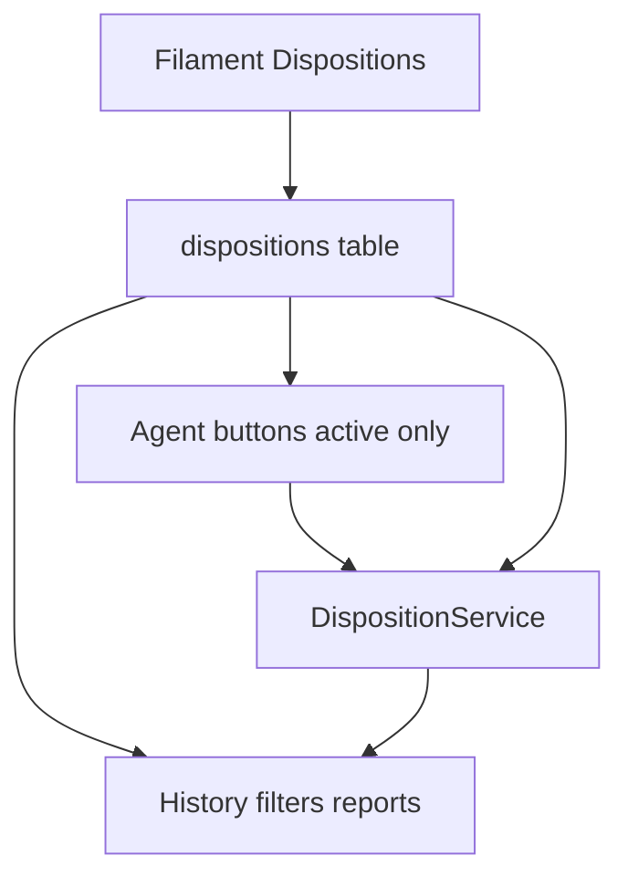

# Configurable dispositions

## Standard vs custom

All **ten current dispositions** are seeded as **standard** (`is_system = true`) per company:

- Booked, Callback, No Answer, Left VM, Not Interested, Not Qualified, Wrong Number, Bad Number, DNC, Skip

Standard rules:

- **Cannot be deleted**
- **Can be made inactive** — hides the agent-workspace button only
- **Slug and outcome stay locked** (Booked always books, DNC always pushes DNC, etc.)
- Admins can still change **label**, **sort order**, **color**, **button group**, **requires reason**, **increments attempt**, and **active**

Custom dispositions admins create can only be **callable** (stay on the list, like No Answer) or **terminal** (off the list, like Not Interested). Custom rows can be deactivated; delete only if unused in history.

**Inactive still show their outcomes.** Turning a disposition off does not erase it:

- Agent buttons: **active only**
- Lead history pills, last-disposition column/filter, calling-list counts, dashboards: **still list the outcome** (standard rows always; custom rows if they have history)
- Labels and colors come from the definition even when `active = false`
- Programmatic actions (e.g. Leads “mark DNC”) still apply the outcome if that row exists, whether or not the agent button is shown

History keeps storing `payload.disposition` as the **slug string** (`booked`, `no_answer`, `language-barrier`, …).

## Data model

New table `dispositions` (model `DispositionDefinition`, same pattern as [`LeadTypeDefinition`](app/Models/LeadTypeDefinition.php): company-scoped, `BelongsToCompany`, `RecordsSettingsChanges`):

- `slug` — unique per company; standard rows use current enum values
- `label`, `sort_order`, `active`
- `is_system` — standard/seeded; cannot delete; slug/outcome locked
- `outcome` — `callable` | `terminal` | `booked` | `callback` | `dnc` | `skip`
- `increments_attempt`, `requires_reason`
- `button_group` — `primary` | `contact` | `negative` | `compliance` | `utility` (agent-panel layout)
- `color` — required, from a small enum (not free-form hex)
- `report_group` — maps into dashboard buckets (`booked`, `not_interested`, `not_qualified`, `no_answer_vm`, `wrong_dnc`, `callbacks`, `skipped`, `other`)

Keep [`app/Enums/Disposition.php`](app/Enums/Disposition.php) as the **standard slug list** (LeadMaster mapping, tests). Add small enums for `outcome`, `button_group`, `report_group`, and `color`.

### Color palette (select only)

A few named choices so buttons and history pills stay consistent:

- **Green** — default Booked
- **Blue** — default Callback
- **Slate** — default No Answer / Left VM / Skip
- **Amber** — optional highlight (callback-adjacent)
- **Red** — default NI / NQ / Wrong / Bad / DNC

Admin form is a Select of these names. Each value maps to the same Tailwind classes used on the agent panel today (button background + history pill).

[`DispositionReason`](app/Models/DispositionReason.php): stop casting `disposition` to the PHP enum. Store the parent **slug**. Reason parent options: dispositions with `requires_reason` (include inactive parents so existing reasons stay editable).

Seed the current 10 rows for every existing company (migration + seeder). Seed again when a company is created.

## Apply path

[`DispositionService`](app/Services/Leads/DispositionService.php) loads the company row by slug (including inactive) and applies by `outcome`:

- `callback` — datetime/compliance checks
- `callable` / `skip` — stay callable, advance day part (skip still updates `queue_rank`)
- `terminal` — `LeadStatus::Terminal`
- `booked` / `dnc` — unchanged
- `requires_reason` / `increments_attempt` come from the row

Agent workspace only offers **active** slugs. `DispositionService` may still apply an inactive standard slug from admin actions (DNC on the leads table).

Call sites must not use `Disposition::from()` (throws for custom slugs).

## Agent UI

Replace hard-coded buttons in [`resources/views/livewire/agent/workspace.blade.php`](resources/views/livewire/agent/workspace.blade.php) with **active** dispositions grouped by `button_group`, styled from `color`. Confirmation modal:

- Reason dropdown if `requires_reason`
- Callback datetime only for `outcome = callback`

History pills in [`lead-panel.blade.php`](resources/views/livewire/agent/partials/lead-panel.blade.php) resolve **label and color from the definition even if inactive**, with enum fallback for unknown historical slugs.

## Admin UI

New Filament resource **Configuration → Dispositions** (sort before Disposition Reasons):

- Create: label, auto slug, outcome (callable/terminal only), flags, group, **color select**, report bucket
- Edit: standard rows cannot change slug/outcome; **Active toggle allowed on all rows including Booked/Callback/DNC/Skip**
- Delete action hidden/blocked for `is_system`; custom delete blocked if history exists (deactivate instead)
- Table shows outcome, color, active — so standard rows still display their outcome when inactive

Point [`DispositionReasonForm`](app/Filament/Resources/DispositionReasons/Schemas/DispositionReasonForm.php) parent select at this table.

## Downstream (labels and counts)

Do **not** drop inactive standard dispositions from reports and filters. Load all definitions for the company (active and inactive):

- [`LeadsTable`](app/Filament/Resources/Leads/Tables/LeadsTable.php) last-disposition filter
- [`CallingListDispositionCountService`](app/Services/CallingLists/CallingListDispositionCountService.php)
- [`ManagerDashboardService`](app/Services/Dashboard/ManagerDashboardService.php) — count by `report_group`; add **Other** for unmapped/custom

Services that mean a specific standard outcome (booked stats, DNC jobs, LeadMaster map) keep using `Disposition::Booked->value` etc.

## Tests

- Seed defaults on company create so existing tests keep using enum slugs
- Create a custom terminal disposition, attach a reason, apply from workspace
- Custom callable: stays callable, increments attempt
- Standard: cannot delete Booked; **can deactivate Booked** — button gone, history/filter still show Booked
- Inactive color/label still render on a history pill
- Cannot create a second `dnc` slug
- Reason form accepts a custom parent slug
- Calling-list counts include inactive standard slugs and custom slugs
