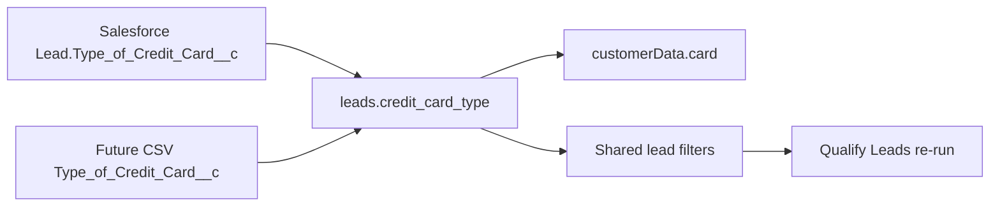

# Credit Card Type field

Salesforce partner criteria expect `customerData.card` for some qualifications. Call Center previously left `card` blank (it only read unused `extra_fields` keys). Imported leads never received Salesforce `Type_of_Credit_Card__c`. This work stores that value, sends it as `card`, backfills existing leads from Salesforce, and adds a filter so Qualify Leads can re-run those rows.

## Field

First-class `leads.credit_card_type` (nullable string after `home_owner`), not an `extra_fields` key.

Exposed on the admin lead form / infolist / toggleable table column, agent workspace (view/edit select next to Homeowner), demographic option lists, and Call Detail report (off by default).

## Import

CSV header `Type_of_Credit_Card__c` maps to `credit_card_type` in `KNOWN_IMPORT_FIELDS`, Standard / SSIS / TNB seed mappings, and a data migration that **adds** that key to existing `import_mappings.column_map` JSON when missing.

## Qualification

`QualificationClient::buildCustomerData()` sets `card` from `credit_card_type` only. Blank column sends `""`. Extra fields `card` / `credit` / `credit_range` are ignored and not merged into the payload.

## Salesforce backfill

Intake is still CSV. Command `salesforce:sync-credit-card-type` (`--dry-run`, `--force`, `--company=`) chunks local leads that have an `external_lead_id` (Salesforce Lead Id `00Q…`) and a blank `credit_card_type`, queries `SELECT Id, Type_of_Credit_Card__c FROM Lead WHERE Id IN (...)`, and updates matches.

Rows that are not Lead Ids are skipped and counted. Blank-only unless `--force`. The Salesforce integration user must have **Read on Lead** and FLS on `Type_of_Credit_Card__c`. The current Connected App user can call qualification Apex and query some custom objects, but staging currently returns `INVALID_TYPE` for `Lead`.

After code lands: forward migrate, then run the command against local Docker Postgres. After prod deploy, run the same command on prod.

## Filters

Credit Card Type is on the shared Qualify / Assign / All Leads filter stack (`LeadsTableFilters`, `HoldingFilter`, `LeadTableFilterMapper`, `HoldingReleaseService`). Operators can filter to populated card types on Qualify Leads and re-queue qualification (`force: true` already).

Out of scope unless asked: FormYoula booking URL field `8b2b-f30e-1451` (“Which Credit Card Do You Mostly Use?”).
