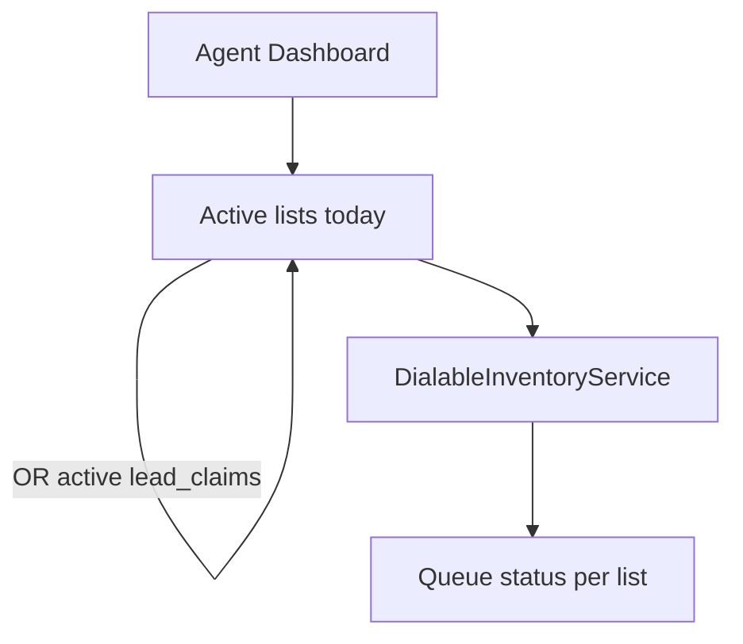

# Agent Dashboard queue status

The Filament page labeled **Agent Dashboard** ([app/Filament/Pages/Dashboard.php](../app/Filament/Pages/Dashboard.php), `/admin`) is the manager home. It currently shows historical Totals and Results by Rep. Calling-list **Queue status** already exists on the list view page and is computed by `DialableInventoryService` + `DialableInventory::queueStatusRows()`.

This work adds that same breakdown to the dashboard, **one table per list**, for lists with today’s dialing activity or an active claim.

## Which lists appear

A list is included if **either**:

- It has a `lead_history` Disposition or Skip today, using the company timezone window from `ManagerDashboardService::todayRange()` (same “today” as the rest of the dashboard). List membership is the lead’s **current** `calling_list_id` (same approach as the existing calling-list report filter).
- It has at least one lead with an active claim (`lead_claims.expires_at` in the future).

Lists with neither are omitted. If a list was worked today but has no remaining callable/callback leads, still show it with an empty/zero inventory so a manager can see they have nothing left.

This section is a **live remaining-inventory snapshot**. It does **not** follow the dashboard’s date-range, rep, or calling-list filters (those stay on Totals / Results by Rep). The existing Refresh button re-renders it.

## Reuse existing count engine

Do not reimplement buckets. `DialableInventoryService::activeTodayForCompany()`:

- Resolves the list IDs as above.
- Loads those `CallingList` records (name, ordered by name).
- Reuses `forCompany()` (already request-cached as a singleton) and `DialableInventory::empty()` when a list has no remaining pool.
- Returns a list of `{ list, inventory }` for the page.

Cadence slot labels stay per-list (each list can have different day-parts), which is why the layout is one table per list rather than a combined rollup.

## UI

In [resources/views/filament/pages/dashboard.blade.php](../resources/views/filament/pages/dashboard.blade.php), a **Queue status** section appears **after the filters card and before Totals**.

- Heading: `Queue status`
- Empty copy: `No lists have been dialed today.`
- Responsive grid of dashboard cards (1 column on small screens, 2–3 on wide).
- Each card: list name (link to `CallingListResource` view page) + existing [resources/views/filament/resources/calling-lists/queue-status.blade.php](../resources/views/filament/resources/calling-lists/queue-status.blade.php) with `showHeading` false.
- Compact table styles in [public/css/manager-dashboard.css](../public/css/manager-dashboard.css).

`Dashboard::queueStatuses()` calls the service (same pattern as Lead Dashboard’s `snapshot()`).

## Tests

- [tests/Feature/DialableInventoryServiceTest.php](../tests/Feature/DialableInventoryServiceTest.php): include a list with today’s disposition; include a list with only an active claim; exclude a list with neither; include a dialed-today list that has zero remaining callable leads.
- [tests/Feature/AdminDashboardTest.php](../tests/Feature/AdminDashboardTest.php): page shows `Queue status`, the active list name, and `Ready now`; does not show an idle list.
