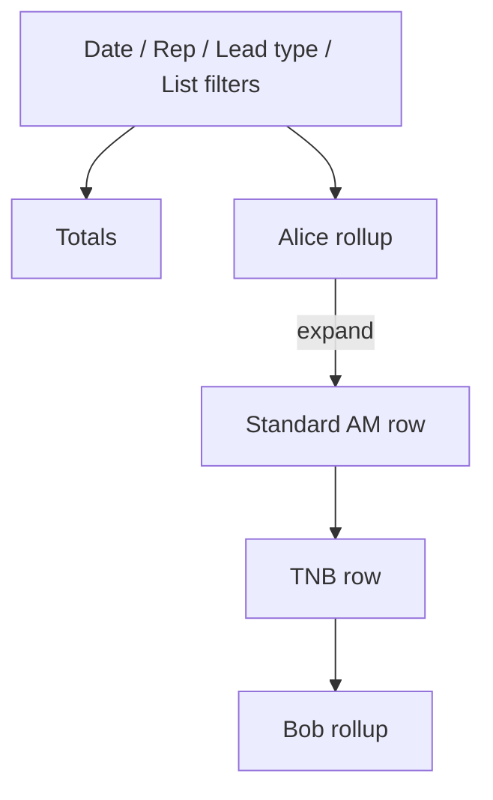

# Results by Rep × Calling List

The Agent Dashboard already shows **Totals** and a wide **Results by Rep** table (count + % per disposition group). The extra question managers ask is mix: *how did this rep do on each list?*

Keep the current rollup as the default view. Expanding a rep **grows the table downward**: extra full-width `<tr>` rows insert directly under that rep, one list per row, same metric columns. Not a dropdown overlay, not extra columns, not a nested table inside a cell. Collapsed by default, with **Expand all / Collapse all**.

Example after expanding Alice (Bob is pushed down):

```
Rep              Total  Booked  ...
Alice            40     8
  Standard AM    25     6
  TNB            15     2
Bob              12     1
```



## Behavior

- Parent row stays the current per-rep totals (unchanged).
- On expand, list rows are **sibling table rows** inserted under that rep, stacking vertically so later reps (and the Total footer) shift down.
- Child rows use the same metric definitions and the same % rule: **% of that row’s Total Leads Called**.
- List name goes in the sticky first column (indented). Null `calling_list_id` labels as **Holding**.
- Show the chevron only when a rep has **more than one** list in the breakdown. A single-list rep (including when the Calling list filter is already set) stays a flat row.
- Alpine.js on the existing Filament page (no Livewire round-trip). Filter/refresh re-renders the table and collapses again, which is fine.
- **Attribution:** the lead’s **current** `calling_list_id`, same as today’s calling-list filter and Queue status. If a lead moved lists after the call, the result follows the current list. Do not snapshot list onto `lead_history` in this pass.
- **Overdue Call Backs** on child rows: live snapshot grouped by `callback_owner_id` + current `calling_list_id` (same live meaning as the parent column).

## Data

Extend [`ManagerDashboardService::report()`](../app/Services/Dashboard/ManagerDashboardService.php) so each agent includes a `lists` array.

While walking history (already loaded in PHP), bucket by `actor_id` and `lead.calling_list_id`. Eager-load `leads.calling_list_id` on the existing `historyQuery()`. Resolve list names in one `CallingList` query; sort lists by name with Holding last.

[`AgentStatsService::scoreboardForUser()`](../app/Services/Leads/AgentStatsService.php) only reads `$report['totals']`, so the extra key is backward compatible. The digest will call `report()` for the prior day instead of `perAgentStatsForRange()` (leave that method as-is).

## UI

In [`resources/views/filament/pages/dashboard.blade.php`](../resources/views/filament/pages/dashboard.blade.php), wrap the Results by Rep card in Alpine state.

- Section header: **Expand all** / **Collapse all** (hidden if no rep has multiple lists).
- Rep name cell: toggle button + chevron when `count(lists) > 1`.
- Immediately after each rep `<tr>`, emit one sibling `<tr class="list-row">` per list. `x-show` on those rows so the table height grows when opened.

Styles in [`public/css/manager-dashboard.css`](../public/css/manager-dashboard.css): indent, slightly muted nested background, sticky first-column background that matches the nested row.

## Daily dashboard email

[`DashboardDigestService`](../app/Services/Dashboard/DashboardDigestService.php) calls `report()` for the prior local day via `dateRange()` and renders the same metric grid in [`resources/views/mail/dashboard-digest.blade.php`](../resources/views/mail/dashboard-digest.blade.php) with inline styles. List rows are always stacked (email has no Alpine). Nested rows only when that rep has more than one list.

## Out of scope

- Charts, a separate “by list only” table, or changing Queue status.
- Snapshotting `calling_list_id` onto history events.
- Agent workspace scoreboard (still totals-only).
- Deleting unused `perAgentStatsForRange()`.
