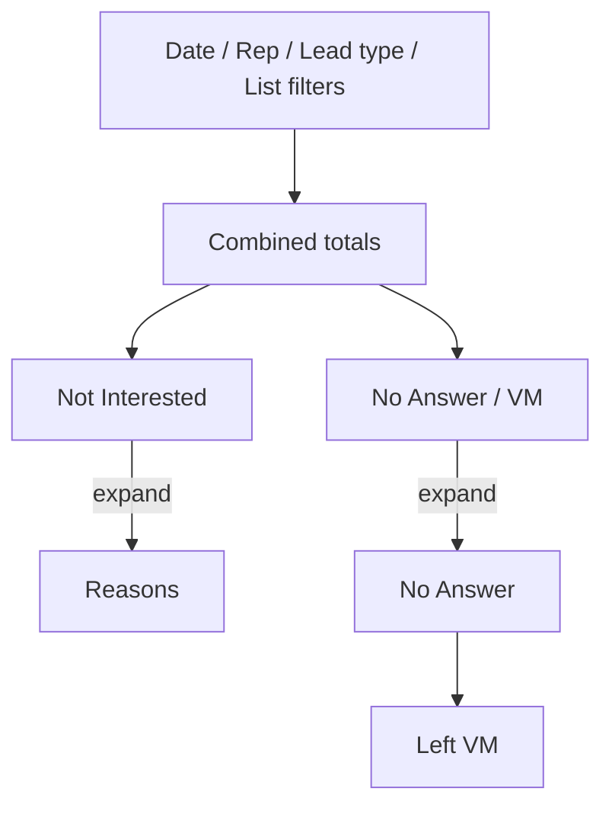

# Expand Agent Dashboard totals by disposition and reason

The Agent Dashboard **Totals** strip currently shows one number per **report group** (Booked, Not Interested, No Answer / VM, Wrong / DNC, and so on). Managers cannot see which dispositions sit inside a bucket, or which **reasons** make up Not Interested / Not Qualified / Skip.

Keep those combined numbers as **one parent row** on the same wide grid as Results by Rep. Expanding a metric header **grows the table downward**: extra rows insert under Totals, with the child count/% only in that metric’s columns. Not a dropdown overlay, not a vertical Metric / Count / % table. Collapsed by default, with **Expand all / Collapse all**.

Example after expanding Not Interested and No Answer / VM:

```
         Total  Booked  NI ▼           NA/VM ▼
Totals   140    8       12             40
                        Too Busy 7     No Answer 25
                        Travel Dist 5  Left VM 15
```



## Behavior

- Parent rows stay the current report-group totals (unchanged counts and %).
- On expand, child rows are **sibling table rows** under that metric. Later metrics (and the footnote) shift down.
- Child % uses the same rule as today: **% of total leads called**, so children add up to the parent’s %.
- **What appears under a bucket** (omit zero-count rows):
  - **Bundled buckets** (No Answer / VM, Wrong / DNC, Other): children are always the actual dispositions, even when only one slug has counts. If a disposition also has reasons, nest reasons under that disposition, always visible once the parent metric is open (no second click).
  - **Single-slug buckets with reasons** (Not Interested, Not Qualified, Skipped): skip the redundant disposition row; children are the reasons.
  - **Single-slug buckets with no reasons** (Booked, Callback): no chevron.
- Chevron when the metric has a published breakdown. Bundled buckets get a chevron whenever the parent count is non-zero.
- **Total Leads Called** and **Overdue Call Backs** never expand. Overdue is a live snapshot, not history.
- Alpine.js on the existing Filament page (no Livewire round-trip). Filter/refresh re-renders and collapses again, which is fine.
- Independent expand state from Results by Rep.

## Totals layout

Totals uses the **same wide grid** as Results by Rep: sticky first column, **Total**, then each report-group metric as # / %. Shared header: [`resources/views/filament/pages/partials/dashboard-metric-thead.blade.php`](../resources/views/filament/pages/partials/dashboard-metric-thead.blade.php). Cursor rule: [`.cursor/rules/dashboard-tables.mdc`](../.cursor/rules/dashboard-tables.mdc).

Section header: **Totals** plus **Expand all / Collapse all** (hidden if no metric has a breakdown). Chevrons sit on expandable **metric headers**, not on a stacked metric list.

Child **label sits in the sticky first column**; count and % sit in the owning metric’s # / % cells. Alternate Totals breakdown rows are striped. Reuse `.list-row` in [`public/css/manager-dashboard.css`](../public/css/manager-dashboard.css).

## Data

Reasons already live on history as the **label string**: `payload.reason` from [`DispositionService`](../app/Services/Leads/DispositionService.php). Older skip rows may use `payload.skip_reason`. While walking history in [`ManagerDashboardService::report()`](../app/Services/Dashboard/ManagerDashboardService.php), bucket each Disposition / Skip row by:

1. report group (existing `reportGroupMap`)
2. disposition slug (`skip` for Skip events)
3. reason string (`payload.reason`, else `payload.skip_reason`; blank → count toward the slug with no reason child)

Do not attach `items` onto `$report['totals']` entries. [`AgentStatsService::scoreboardForUser()`](../app/Services/Leads/AgentStatsService.php) returns `$report['totals']` to the agent workspace. Add a sibling key:

```php
return [
    'totals' => $totals,       // unchanged {label, count, percent}
    'breakdowns' => [...],     // keyed by metric key
    'agents' => $agents,
];
```

Each breakdown value is a list of children:

```php
[
    'kind' => 'disposition'|'reason',
    'slug' => ?string,          // disposition only
    'label' => string,
    'count' => int,
    'percent' => ?float,
    'items' => list<...>,       // reasons under a disposition; empty for reason rows
]
```

Build children only when they would actually render (more than one child). Labels: `DispositionDefinition` label for slugs (include inactive); fallback to enum label or the raw slug. Reason labels are the stored strings. Sort dispositions by definition `sort_order` then label; reasons by `DispositionReason.sort_order` for that slug when a matching row exists, then label. Unmatched / blank reasons last (`No reason` only when that slug also has named reasons).

Same date / rep / lead type / calling-list filters as today’s totals. No extra queries beyond loading definition labels (already loaded for `reportGroupMap`) and reason sort orders (one `DispositionReason` query for the company).

## UI

In [`resources/views/filament/pages/dashboard.blade.php`](../resources/views/filament/pages/dashboard.blade.php), wrap the Totals card in Alpine state (`expandedKeys`, `toggle`, `expandAll`, `collapseAll`). One parent Totals row uses the shared metric header. Child `<tr>`s with `x-show` follow that row.

## Daily dashboard email

[`resources/views/mail/dashboard-digest.blade.php`](../resources/views/mail/dashboard-digest.blade.php) renders Totals on the same wide grid as Results by Rep. After the Totals row, always stack child rows (email has no Alpine), with counts only in the owning metric columns. Nested rows only when that metric has a breakdown. Pass `$report['breakdowns']` from [`DashboardDigestService`](../app/Services/Dashboard/DashboardDigestService.php).

## Tests

- [`tests/Feature/ManagerDashboardServiceTest.php`](../tests/Feature/ManagerDashboardServiceTest.php): No Answer + Left VM appear under `no_answer_vm`; Wrong Number / Bad Number / DNC under `wrong_dnc`; NI/NQ/Skip reasons from `payload.reason`; skip `skip_reason` still counted; single-slug Booked has no breakdown; a single custom slug in Other still expands; a single Wrong / DNC slug still expands; filters still apply to children; percents are of total leads called.
- [`tests/Feature/AdminDashboardTest.php`](../tests/Feature/AdminDashboardTest.php): shared wide headers (`Total`, # / %); chevron on No Answer / VM, Wrong / DNC, and Other; no chevron on Booked.
- [`tests/Feature/DashboardDigestServiceTest.php`](../tests/Feature/DashboardDigestServiceTest.php): digest HTML includes child labels when the prior day has a split bucket.

## Out of scope

- Expanding Results by Rep cells by reason or disposition (list expand stays as-is).
- Agent workspace scoreboard (still totals-only).
- Overdue Call Backs composition.
- Charts, or changing report-group membership.
