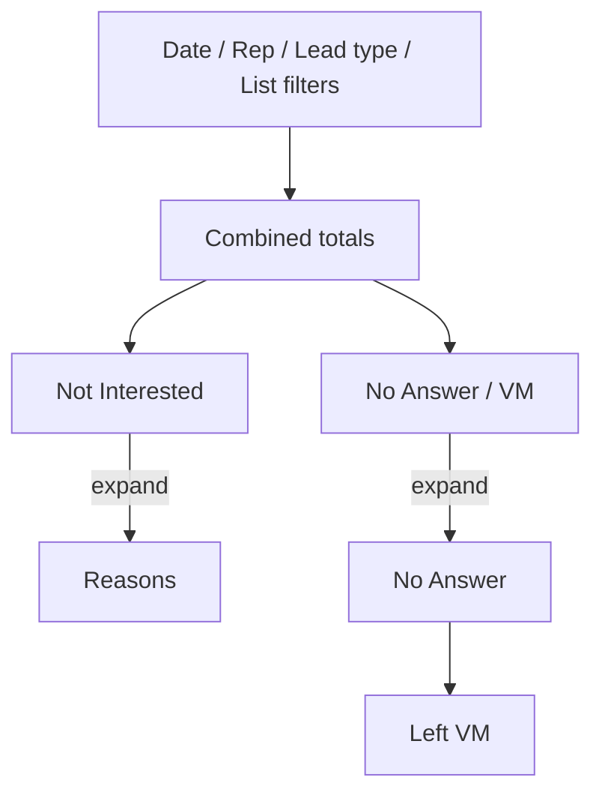

# Expand Agent Dashboard totals by disposition and reason

The Agent Dashboard **Totals** strip currently shows one number per **report group** (Booked, Not Interested, No Answer / VM, Wrong / DNC, and so on). Managers cannot see which dispositions sit inside a bucket, or which **reasons** make up Not Interested / Not Qualified / Skip.

Keep those combined numbers as the parent rows. Expanding a total **grows the section downward**: extra rows insert under that metric, same Count / % columns. Not a dropdown overlay, not extra columns, not a nested table inside a card. Collapsed by default, with **Expand all / Collapse all**.

Example after expanding Not Interested and No Answer / VM:

```
Metric              Count   %
Total Leads Called  140
Booked              8       5.7%
Not Interested  ▼   12      8.6%
  Too Busy          7       5.0%
  Travel Distance   5       3.6%
No Answer / VM  ▼   40     28.6%
  No Answer         25     17.9%
  Left VM           15     10.7%
Wrong / DNC         15     10.7%
```



## Behavior

- Parent rows stay the current report-group totals (unchanged counts and %).
- On expand, child rows are **sibling table rows** under that metric. Later metrics (and the footnote) shift down.
- Child % uses the same rule as today: **% of total leads called**, so children add up to the parent’s %.
- **What appears under a bucket** (omit zero-count rows):
  - **More than one disposition slug** in the group: children are those dispositions (definition label, inactive still shown). If a disposition also has reasons, nest reasons under that disposition, always visible once the parent metric is open (no second click).
  - **One disposition slug with reasons**: skip the redundant disposition row; children are the reasons.
  - **One disposition slug and no reasons**: no chevron (Booked, Callback, a single-slug Other, etc.).
- Chevron only when the metric has **more than one** child after omitting zeros. Same rule as Results by Rep (chevron only when a rep has more than one list).
- **Total Leads Called** and **Overdue Call Backs** never expand. Overdue is a live snapshot, not history.
- Alpine.js on the existing Filament page (no Livewire round-trip). Filter/refresh re-renders and collapses again, which is fine.
- Independent expand state from Results by Rep.

## Totals layout

The current Totals UI is a tight horizontal card grid (`minmax(5.5rem)`). Reason labels such as `Home Owner Less Then 3 Years` will not fit inside those cards.

Replace the Totals **card grid** with a compact three-column table: **Metric / Count / %**. That matches the daily digest Totals table and the expand-down pattern already used on Results by Rep.

Section header: **Totals** plus **Expand all / Collapse all** (hidden if no metric has a breakdown).

Indent child rows; disposition children one step, nested reasons a second step. Reuse the nested-row styles from `.list-row` in [`public/css/manager-dashboard.css`](../public/css/manager-dashboard.css).

## Data

Reasons already live on history as the **label string**: `payload.reason` from [`DispositionService`](../app/Services/Leads/DispositionService.php). Older skip rows may use `payload.skip_reason`. While walking history in [`ManagerDashboardService::report()`](../app/Services/Dashboard/ManagerDashboardService.php), bucket each Disposition / Skip row by:

1. report group (existing `reportGroupMap`)
2. disposition slug (`skip` for Skip events)
3. reason string (`payload.reason`, else `payload.skip_reason`; blank → count toward the slug with no reason child)

Do not attach `items` onto `$report['totals']` entries. [`AgentStatsService::scoreboardForUser()`](../app/Services/Leads/AgentStatsService.php) returns `$report['totals']` to the agent workspace. Add a sibling key:

```php
return [
    'totals' => $totals,       // unchanged {label, count, percent}
    'breakdowns' => [...],     // keyed by metric key
    'agents' => $agents,
];
```

Each breakdown value is a list of children:

```php
[
    'kind' => 'disposition'|'reason',
    'slug' => ?string,          // disposition only
    'label' => string,
    'count' => int,
    'percent' => ?float,
    'items' => list<...>,       // reasons under a disposition; empty for reason rows
]
```

Build children only when they would actually render (more than one child). Labels: `DispositionDefinition` label for slugs (include inactive); fallback to enum label or the raw slug. Reason labels are the stored strings. Sort dispositions by definition `sort_order` then label; reasons by `DispositionReason.sort_order` for that slug when a matching row exists, then label. Unmatched / blank reasons last (`No reason` only when that slug also has named reasons).

Same date / rep / lead type / calling-list filters as today’s totals. No extra queries beyond loading definition labels (already loaded for `reportGroupMap`) and reason sort orders (one `DispositionReason` query for the company).

## UI

In [`resources/views/filament/pages/dashboard.blade.php`](../resources/views/filament/pages/dashboard.blade.php), wrap the Totals card in Alpine state (`expandedKeys`, `toggle`, `expandAll`, `collapseAll`). Emit child `<tr>`s with `x-show` immediately after each expandable metric.

## Daily dashboard email

[`resources/views/mail/dashboard-digest.blade.php`](../resources/views/mail/dashboard-digest.blade.php) already renders Totals as Metric / Count / %. After each expandable metric, always stack the same child rows (email has no Alpine). Nested rows only when that metric has a breakdown. Pass `$report['breakdowns']` from [`DashboardDigestService`](../app/Services/Dashboard/DashboardDigestService.php).

## Tests

- [`tests/Feature/ManagerDashboardServiceTest.php`](../tests/Feature/ManagerDashboardServiceTest.php): No Answer + Left VM appear under `no_answer_vm`; Wrong Number / Bad Number / DNC under `wrong_dnc`; NI/NQ/Skip reasons from `payload.reason`; skip `skip_reason` still counted; single-slug Booked has no breakdown; custom slug in Other; filters still apply to children; percents are of total leads called.
- [`tests/Feature/AdminDashboardTest.php`](../tests/Feature/AdminDashboardTest.php): Totals table headers; chevron markup when a bucket has multiple children; no chevron on Booked.
- [`tests/Feature/DashboardDigestServiceTest.php`](../tests/Feature/DashboardDigestServiceTest.php): digest HTML includes child labels when the prior day has a split bucket.

## Out of scope

- Expanding Results by Rep cells by reason or disposition (list expand stays as-is).
- Agent workspace scoreboard (still totals-only).
- Overdue Call Backs composition.
- Charts, or changing report-group membership.
