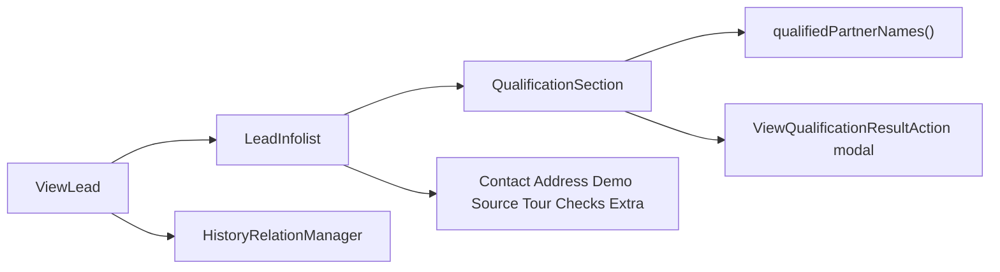

# Lead view layout and qualification fields

Replace the flat read-only lead form with a sectioned Filament infolist, surface currently qualified partners, and give the History table real column widths so Event/Actor/Details no longer run together.

## Problem

[`ViewLead`](app/Filament/Resources/Leads/Pages/ViewLead.php) has no infolist, so Filament renders [`LeadForm`](app/Filament/Resources/Leads/Schemas/LeadForm.php) as one long disabled field list. That form also never shows `qualification_result`, so **currently qualified partners** from the qualification API (`qualifiedCompaniesBooking` → [`Lead::qualifiedPartnerNames()`](app/Models/Lead.php)) are missing. RND status is stored on the lead but also absent.

The list table already opens the full API dump via [`ViewQualificationResultAction`](app/Filament/Actions/ViewQualificationResultAction.php) + [`resources/views/filament/qualification-result.blade.php`](resources/views/filament/qualification-result.blade.php). The individual view should show the answer on the page, not only in that modal.

## Approach

Add a dedicated infolist (same pattern as [`LeadHistoryInfolist`](app/Filament/Resources/LeadHistories/Schemas/LeadHistoryInfolist.php)) and wire it on [`LeadResource`](app/Filament/Resources/Leads/LeadResource.php). Leave [`LeadForm`](app/Filament/Resources/Leads/Schemas/LeadForm.php) for create/edit unchanged.

## Sections (2–3 columns)

Use Filament `Section` + `TextEntry` (badges for enums). Empty values use `placeholder('—')`. Hide Tour unless TNB or any tour field is filled.

- **Status and queue** — status, lead type, calling list, added to list, queue rank, attempts, next day part, last attempt, callback at/owner
- **Contact** — phone, phone 2, names, secondary names, email, timezone
- **Address** — address, address 2, city, state, zip
- **Demographics** — age range, income, marital status, gender, home owner
- **Source** — venue, event, imported `partner_list`, original submit date, external ID, file name, import batch, imported at
- **Tour** — tour location/dates/premiums/result/no-show, booking ID
- **Qualification** — status, last checked, last error, **Currently qualified partners** (`implode(', ', $record->qualifiedPartnerNames())`, same meaning as agent “Qualified to Tour At”), plus a compact list of booking companies (name / vertical / priority) from `qualificationCompanies('qualifiedCompaniesBooking')` when present
- **Soft Score** — code, status, last checked, last error
- **DNC** — status, `dncDetailLabel()`, last checked, last error
- **RND** — status, last checked, last error (currently missing from the form)
- **Extra fields** — `KeyValueEntry` for `extra_fields` when non-empty

## History table (bottom of the view)

[`HistoryRelationManager`](app/Filament/Resources/Leads/RelationManagers/HistoryRelationManager.php) already has When / Event / Actor / Details / Note, but none of the columns have widths. Filament lets Details grow and the short columns collapse, so rows read as one blob (`Claim ExpireJesus SanchezReleased`).

Fix the relation-manager table in place (do not switch to the HTML `history-table` Blade used on slide-overs):

- **When** — `grow(false)`, no wrap, format with `CompanyTimezone::display(..., 'M j, Y g:i A T')` like [`LeadHistoriesTable`](app/Filament/Resources/LeadHistories/Tables/LeadHistoriesTable.php)
- **Event** — keep badge, `grow(false)`
- **Actor** — `grow(false)`, placeholder System
- **Details** — `grow()`, `wrap()`, `alignStart()` so long field-edit text stays in its column instead of crowding Actor
- **Note** — `wrap()`, `grow(false)`, placeholder —
- `->striped()` so rows have a visual grid
- Keep the table read-only; no new row actions unless a Details tooltip is needed for very long field edits (`->tooltip()` when the label is long)

## Qualification detail (not dumped on the page)

Keep raw request/response, posted values, qualified-lead companies, and failed criteria in the existing modal. Add header actions on [`ViewLead`](app/Filament/Resources/Leads/Pages/ViewLead.php):

- `ViewQualificationResultAction` (visible when `qualification_status` is set)
- `ViewDncResultAction` (visible when `dnc_status` is set)
- existing Edit / Delete

## Tests

Extend [`tests/Feature/ViewLeadTest.php`](tests/Feature/ViewLeadTest.php):

- Assert section headings (e.g. Contact, Qualification)
- Seed `qualification_result` with a `qualifiedCompaniesBooking` company and assert the partner name is on the view
- Assert RND status label appears when set
- Assert History still shows When / Event / Actor / Details / Note and a sample actor + detail remain visible as separate strings
