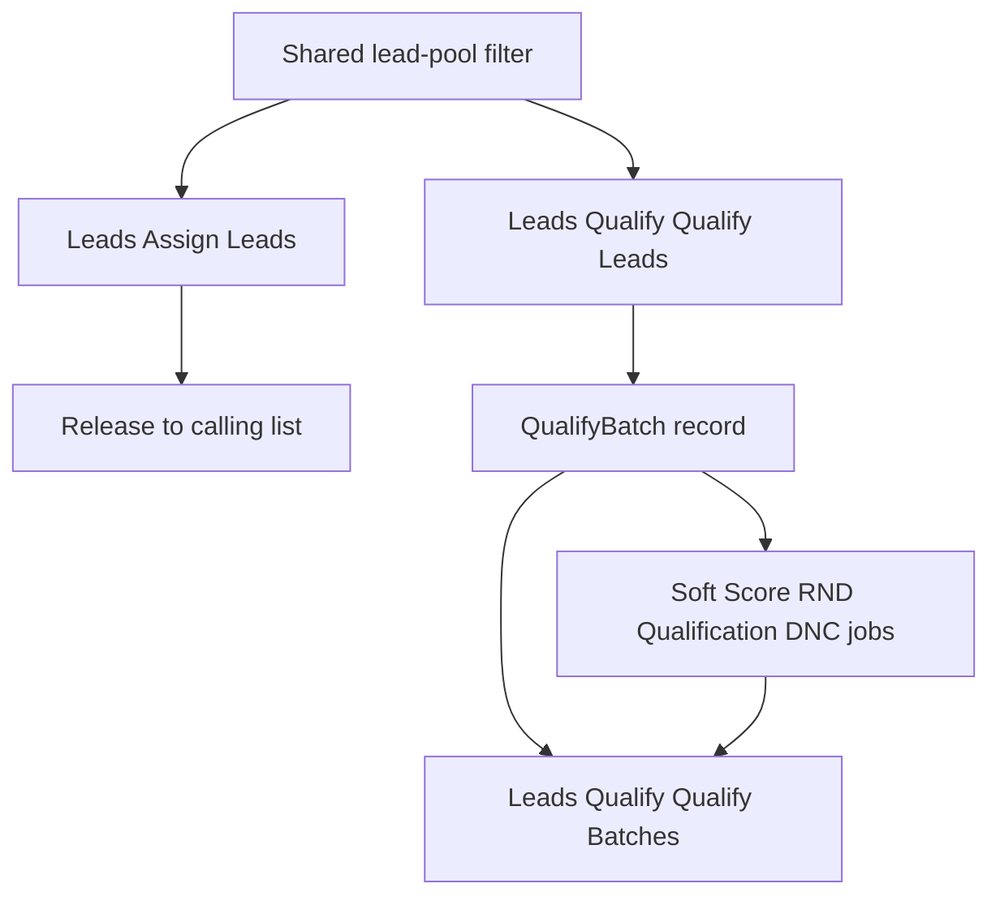

# Qualify Leads + Qualify Batches

A **Qualify** submenu under Leads, not a button on Assign Leads. Extract the Assign Leads filter into a reusable component both pages use. After submit, create a **Qualify Batch** and redirect to an import-batch-style progress/results view.

**Naming:** the page is the whole check pipeline (Soft Score, RND, Salesforce Qualification, DNC). The Salesforce partner check stays labeled **Qualification** on the toggles so it is not confused with the page name.

## Why a separate menu

Assign and Qualify share **how you pick leads**, not **what you do with them**.

- Assign is “these Holding/list leads are callable — put them on a list.” The count is assignable-only.
- Qualify is “run Soft Score / RND / Qualification / DNC on this set.” The count includes DNC hits, RND reassigned, and errors.

Two pages with one filter component stays parallel to **Import CSV** vs **Import Batches**.

Nav uses the same parent-item pattern as Dashboards / Reports in [AdminPanelProvider.php](app/Providers/Filament/AdminPanelProvider.php) (`navigationParentItem`):

- **Leads**
  - Assign Leads (existing)
  - **Qualify** (parent item; URL to Qualify Leads)
    - **Qualify Leads** — filter + check toggles + preview + queue
    - **Qualify Batches** — past/in-progress runs (same role as Import Batches)

Register the Qualify parent with `NavigationItem::make` in the Leads group. Both the page and resource set `navigationGroup = 'Leads'` and `navigationParentItem = 'Qualify'` (constant, same style as [DashboardNavigation.php](app/Filament/Navigation/DashboardNavigation.php)).

Keep Import Batch **Run / Retry errors** as they are.

## Reusable filter component

Pull the private filter UI out of [AssignLeads.php](app/Filament/Pages/AssignLeads.php) so both pages render the same sections: Import, Venue & event, Lead profile, Tour Info.

Suggested split:

- Filter schema + option loaders — e.g. `app/Filament/Support/LeadPoolFilterForm.php`
- Shared page behavior (`filterData`, defaults, `buildFilter()`, count refresh, Clear Filters) — e.g. `app/Filament/Concerns/InteractsWithLeadPoolFilter.php`
- Preview table columns — shared so both pages list the same lead fields
- Query — [HoldingReleaseService](app/Services/Import/HoldingReleaseService.php): apply **filters** separately from **assignable scopes**. Distinct dropdowns use the same mode as the page (assignable-only on Assign; all matching on Qualify)

Assign Leads becomes a thin page: shared filter + “Assign to List” + assignable query.

Qualify Leads is the same filter + check toggles + all-matching query.

## Qualify Leads page

- Same live count banner and preview table as Assign
- Toggles default on: Soft Score, RND, Qualification, DNC (same as [ImportLeads.php](app/Filament/Pages/ImportLeads.php)); require at least one
- Optional Max Count (freshest N by `imported_at`)
- Confirm: runs selected checks for matching leads, including ones that already have a result; Holding leads stay unassignable while Pending; RND reassigned → Terminal; DNC hits → DNC status
- TCPA: no extra toggle. DNC uses each lead’s import batch `ignore_national_dnc` ([DncService::ignoreNationalDncByLeadId](app/Services/Dnc/DncService.php))
- Submit creates the Qualify Batch, queues jobs, redirects to the batch view

## Qualify Batch (progress + results)

New `qualify_batches` table, shaped like import-batch check tracking. Model `QualifyBatch` (parallel to `ImportBatch`):

- `company_id`, `user_id`, `lead_count`, `filter` JSON
- `run_soft_score` / `run_rnd_check` / `run_qualification` / `run_dnc_check`
- Same pending/result/error counters as `import_batches`
- `status` (`pending` | `processing` | `completed` | `failed`), `error_message`
- `healthStatus()` same rules as [ImportBatch::healthStatus()](app/Models/ImportBatch.php)

Pivot `qualify_batch_leads` so the batch lists **exactly** the queued leads.

Filament resource under **Leads → Qualify**:

- List: health dot, when, who, lead count, which checks, status
- View: `wire:poll` while pending, health/error banners, counters, leads relation manager — mirror [view-import-batch.blade.php](resources/views/filament/resources/import-batches/view-import-batch.blade.php) and [LeadsRelationManager](app/Filament/Resources/ImportBatches/RelationManagers/LeadsRelationManager.php)
- **Retry X errors** for this batch’s error leads only

## What is reused

The four checks are not rewritten. Qualify Leads dispatches the same jobs and services as import and the agent workspace:

- Soft Score: [SoftScoreLeadJob](app/Jobs/SoftScoreLeadJob.php) → [SoftScoreService](app/Services/SoftScore/SoftScoreService.php) (import + workspace `queueScoreAndQualification`)
- Qualification: [QualifyLeadJob](app/Jobs/QualifyLeadJob.php) → [QualificationService](app/Services/Qualification/QualificationService.php) (import + workspace `runQualification` / page load)
- RND: [RndLeadJob](app/Jobs/RndLeadJob.php) → [RndService](app/Services/Rnd/RndService.php) (import)
- DNC: [DncScrubJob](app/Jobs/DncScrubJob.php) → [DncService](app/Services/Dnc/DncService.php) (import)

Chaining matches import: Soft Score first, then Qualification, with `force: true` on Soft Score so a recent score is not skipped (same flag the workspace already passes on a manual re-run).

New code is the filter page, `QualifyBatch` progress record, and an optional `qualifyBatchId` on those jobs so this batch’s counters update. Import-batch counters still move via `lead.import_batch_id` as they do now.

## Job wiring

Add optional `qualifyBatchId` to [SoftScoreLeadJob](app/Jobs/SoftScoreLeadJob.php), [QualifyLeadJob](app/Jobs/QualifyLeadJob.php), [RndLeadJob](app/Jobs/RndLeadJob.php), [DncScrubJob](app/Jobs/DncScrubJob.php).

Import-batch counters still move via `lead.import_batch_id`. Also update the Qualify Batch when `qualifyBatchId` is set.

Queue rules (same as import):

- Skip a lead for a check if that check is already **Pending**
- Soft Score with `force: true` so [SoftScoreService::scoreLead](app/Services/SoftScore/SoftScoreService.php) does not skip a recent score
- Soft Score + Qualification → chain via `dispatchQualificationAfter`
- Qualification only → `QualifyLeadJob` (waits if Soft Score is Pending)
- RND + DNC in parallel; DNC still chunks 25

Do not change Salesforce / Soft Score / RND / DNC APIs.

## Tests

- Shared filter: Assign still assignable-only; Qualify includes DNC/RND-unassignable
- Qualify queues forced Soft Score for already-complete leads; Pending skipped; SS→Qual chained
- QualifyBatch counters move pending → result/error; health pending then ok/error
- Qualify Leads page creates a batch for the filtered set and redirects to the view
- Unselected checks are not queued
