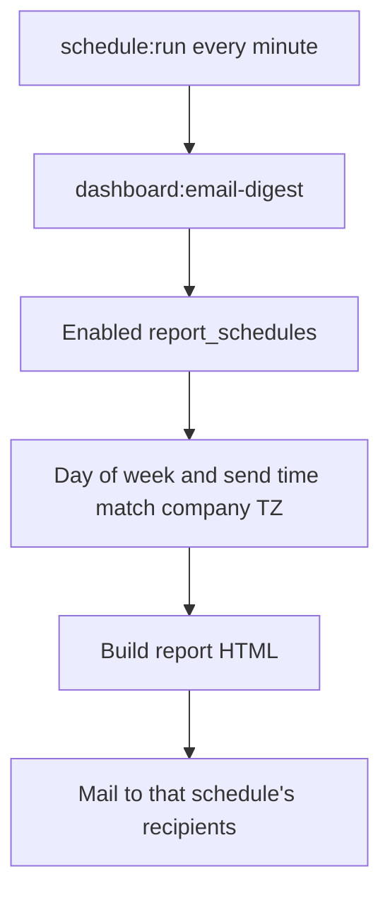

# Report Scheduler

Replace the single company-wide nightly digest with named report schedules under Dashboards and Reports. Each schedule chooses the report, date range (today so far, yesterday, this week, or last week), days, send times, and recipients so some people can get Agent Dashboard, Lead Dashboard, or Performance by Lead Source more often.

## Current behavior

One company-wide send: [`dashboard:email-digest`](../app/Console/Commands/DashboardEmailDigestCommand.php) runs every minute, and if `app_settings.dashboard_email_enabled` is on and local time matches `dashboard_email_send_time`, it emails **yesterday’s Agent Dashboard** to every address in [`dashboard_email_recipients`](../app/Models/DashboardEmailRecipient.php). Enable/time live on App Settings; recipients live under Configuration.

Timezone stays on App Settings (`dashboard_email_timezone`, labeled **Agent timezone**) — it is also used for dashboards and callbacks via [`CompanyTimezone`](../app/Support/CompanyTimezone.php). Do not move it onto schedules.

## Product model

A **schedule** is an independent send rule. Example: leadership gets Agent Dashboard yesterday at 7:00 daily; floor managers get Agent Dashboard today-so-far at 10:00 / 14:00 / 17:00 weekdays; ops gets last week’s Agent Dashboard Monday at 7:00; plus Lead Dashboard at noon.

**Lead Dashboard** is a live inventory snapshot ([`LeadDashboardService::snapshot()`](../app/Services/Dashboard/LeadDashboardService.php)), not a date range. Period is hidden for that report type; the email is always “as of now.”

**Agent Dashboard** and **Performance by Lead Source** use company-timezone ranges, reused from [`ManagerDashboardService::presetDates()`](../app/Services/Dashboard/ManagerDashboardService.php) (weeks are Monday–Sunday, same as the in-app dashboards):

- **Today so far**: local start of today through now (not `endOfDay()`, so the email matches the label)
- **Yesterday**: prior local calendar day
- **This Week**: this Monday through today (week-to-date)
- **Last Week**: previous Monday through Sunday (complete week)

Company-wide totals only (all reps / all lists), matching the current digest. No per-schedule rep or list filters in this pass.

## Data

New tables (both `company_id` + `BelongsToCompany` + `RecordsSettingsChanges`):

**`report_schedules`**

- `name` (required)
- `enabled` (bool, default true)
- `report_type` enum: `agent_dashboard` | `lead_dashboard` | `lead_source`
- `period` nullable enum: `today_so_far` | `yesterday` | `this_week` | `last_week` (null / unused for Lead Dashboard)
- `days_of_week` JSON, e.g. `[1,2,3,4,5]` (ISO 1=Mon … 7=Sun)
- `send_times` JSON, e.g. `["07:00","14:00"]` (minutes, no seconds)
- `group_by` nullable string for Lead Source only (default `venue_and_event`)
- `last_sent_slot` nullable string `Y-m-d H:i` to avoid double-sends in the same minute

**`report_schedule_recipients`**

- `report_schedule_id`, `email`
- unique `(report_schedule_id, email)`

Data migration in the same migration: for each company that has recipients and/or `dashboard_email_enabled`, insert one schedule **Daily Agent Dashboard** (`yesterday`, all 7 days, send time from `dashboard_email_send_time` or `07:00`, `enabled` from `dashboard_email_enabled`) and copy recipient emails.

Leave old columns/tables in place for this pass so we do not risk data loss. Stop using them in app code.

## UI

Filament resource [`app/Filament/Resources/ReportSchedules/`](../app/Filament/Resources/ReportSchedules/) following Cadences / Blackout Dates:

- Nav: group **Dashboards and Reports**, parent **Reports**, label **Report Scheduler**, sort `12` (after Performance by Lead Source)
- Form: name, enabled, report type, period (Today so far / Yesterday / This Week / Last Week; hidden for Lead Dashboard), Lead Source group-by (visible only for that type), days of week (`Select` multiple, not CheckboxList), send times (`Repeater` of `TimePicker` seconds false, min 1), recipients (`Repeater` relationship of email `TextInput`s)
- Table: name, report, period, days, times, recipient count, enabled toggle, Edit
- Header **Send now** on edit (and list row action): send that schedule immediately, ignore day/time, still require ≥1 recipient

Remove from nav and stop using:

- Dashboard Email Recipients
- App Settings fields `dashboard_email_enabled` and `dashboard_email_send_time`

Keep **Agent timezone** on App Settings.

## Send pipeline

Keep the existing artisan command and cron entry in [`bootstrap/app.php`](../bootstrap/app.php). Rewrite the command to loop enabled schedules (optional `--company=` / `--schedule=` / `--force`).

Match when local ISO weekday is in `days_of_week` and local `H:i` equals one of `send_times`, and `last_sent_slot` is not already that minute. `--force` / UI Send now skip day/time/slot checks.

| Type | Builder | Template |
|------|---------|----------|
| Agent Dashboard | digest + period range from `presetDates()` | extend dashboard digest subtitle for period |
| Lead Dashboard | `LeadDashboardService::snapshot()` | `mail/lead-dashboard-digest.blade.php` |
| Lead Source | `LeadSourceReportService::report()` | `mail/lead-source-digest.blade.php` |

Reuse `DashboardDigestMail` (`htmlString` + subject). Send sync `Mail::to(first)->bcc(rest)`.

## Out of scope

- Per-schedule timezone, rep/list filters, hourly intervals, PDF attachments
- Dropping `dashboard_email_recipients` / unused App Settings columns (follow-up after this ships)
