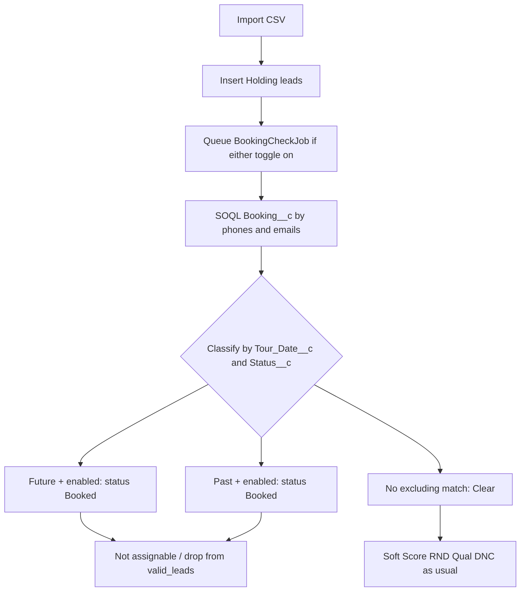

# Salesforce booking check on lead import

## What we are building

A new async import check that queries Salesforce `Booking__c` for each imported lead. Matching is:

- Lead `phone` against `Phone_Cleaned__c` **and** `Phone_2__c`
- Lead `phone_2` against `Phone_Cleaned__c` **and** `Phone_2__c`
- Lead `email` against `Email__c` **and** `Email_2__c`

Two **independent** toggles on **Import CSV** and **Qualify Leads** (same disable-confirm pattern as Soft Score / DNC):

- **Exclude Future Bookings** (default on)
- **Exclude Past Bookings** (default on)

The Salesforce query runs if **either** toggle is on. A found booking only excludes the lead if it matches an enabled toggle.

Qualify Leads is in this pass. It already re-runs Soft Score / RND / Qualification / DNC; booking is the fifth check, using the same `qualifyBatchId` counter pattern as DNC.

**Integrations menu is out of this pass.** It can come later when we pull bookings into the app on their own.

## Match rules

Salesforce object/fields (confirmed):

- Object: `Booking__c`
- Contact: `Phone_Cleaned__c` (formula that cleans `Phone__c`), `Phone_2__c`, `Email__c`, `Email_2__c`
- Display / result payload still includes raw `Phone__c` when we store a match
- Filters: `Tour_Date__c`, `Status__c`

**Future booking** (exclude only if that toggle is on):

- `Tour_Date__c` is today or later
- `Status__c` in `New`, `Rescheduled`, `No Show Rescheduled`, `Agent Callback`

**Past booking** (exclude only if that toggle is on):

- `Tour_Date__c` is before today
- Any status

Today’s date uses the company timezone (same idea as dashboard “today”). A booking with a null tour date does not match either filter.

If both a past and a future booking match, treat it as a **future** hit (stronger / current booking).

## Outcome (like DNC, status Booked)

Leads are still inserted (Holding), then the check runs async.

On an excluded match:

- `leads.status` → `Booked` (do not overwrite `Dnc` or an already-`Booked` lead)
- Booking check status → `future_hit` or `past_hit`
- Lead is **not assignable**
- Counted out of `valid_leads` (same role as `dnc_hit`)

On no excluding match: status `clear`, lead stays in the normal check/assign flow.

On API/query failure: status `error`, not assignable until retried (DNC-style).

Store the matched booking(s) on the lead (`booking_check_result` JSON: Salesforce Id, tour date, status, which fields matched) so the batch UI can show why it was excluded.



## Implementation shape (clone DNC + Salesforce client)

Closest patterns:

- Exclusion / counters / assignability: DNC ([`DncService`](app/Services/Dnc/DncService.php), [`DncScrubJob`](app/Jobs/DncScrubJob.php))
- Salesforce HTTP: [`SalesforceClient`](app/Services/Salesforce/SalesforceClient.php)

### Config

Add a `salesforce.bookings` block in [`config/services.php`](config/services.php) (reuse existing `SALESFORCE_*` creds):

- object `Booking__c`
- field API names
- future status list (exact picklist values above)

Add `SalesforceClient::query(string $soql)` for REST `/services/data/{version}/query` (with `nextRecordsUrl` paging).

### Phone / email matching

Normalize lead phones with existing `PhoneNormalizer` (10 digits).

**Primary phone (`Phone__c`):** do **not** query `Phone__c` with format variants. Salesforce already has `Phone_Cleaned__c`, a formula on `Phone__c`. SOQL match:

```
Phone_Cleaned__c IN ('4045551212', ...)
```

using the same 10-digit value `PhoneNormalizer` produces. During implementation, confirm the formula’s actual output (digits only vs dashed). If it is not 10 digits, put a small normalizer on the SF value in config rather than guessing formats in SOQL.

**Phone 2:** there is no cleaned formula mentioned for `Phone_2__c`. Query `Phone_2__c` with common formats of each 10-digit number, then confirm in PHP after normalizing SF `Phone_2__c` to 10 digits.

Emails: case-insensitive / trimmed against `Email__c` and `Email_2__c`.

Batch like DNC (chunks of ~25 leads) so SOQL `IN` lists stay short.

### Data model

**`leads`**

- `booking_check_status` (nullable string / enum)
- `booking_checked_at`
- `booking_check_last_error`
- `booking_check_result` (json)

Enum `BookingCheckStatus`: `Pending`, `Clear`, `FutureHit`, `PastHit`, `Error`

- `isAssignable()`: only `Clear` (and null = check not run)

**`import_batches`**

- `exclude_future_bookings`, `exclude_past_bookings` (bool)
- counters: `booking_check_pending`, `booking_check_clear`, `booking_future_hit`, `booking_past_hit`, `booking_check_error`

`runBookingCheck` is derived: either toggle is true.

Update [`ImportBatch::valid_leads`](app/Models/ImportBatch.php) and `healthStatus()` / pending scopes to include this check.

### Jobs / services / import wiring

New files:

- [`app/Services/Salesforce/SalesforceBookingClient.php`](app/Services/Salesforce/SalesforceBookingClient.php) — SOQL + parse
- [`app/Services/Salesforce/SalesforceBookingService.php`](app/Services/Salesforce/SalesforceBookingService.php) — pending → query → persist status/history/counters; set `LeadStatus::Booked` on hits
- [`app/Jobs/BookingCheckJob.php`](app/Jobs/BookingCheckJob.php) — chunked like `DncScrubJob`; optional `qualifyBatchId` like the other check jobs

### Qualify Leads / Qualify Batches

Qualify currently only queues Soft Score, RND, Qualification, and DNC ([`QualifyLeads.php`](app/Filament/Pages/QualifyLeads.php), [`QualifyLeadsService`](app/Services/Qualify/QualifyLeadsService.php), [`QualifyBatch`](app/Models/QualifyBatch.php)). Add the same two booking toggles there (defaults on). A Qualify run stores `exclude_future_bookings` / `exclude_past_bookings` on the **QualifyBatch** (not inherited from the lead’s import batch).

Same skip rule as the other qualify checks: skip if booking check is already **Pending**; otherwise re-run even if the lead already has a result.

Wire:

- [`QualifyLeads`](app/Filament/Pages/QualifyLeads.php) — two toggles; “at least one check” includes either booking toggle
- [`QualifyLeadsService`](app/Services/Qualify/QualifyLeadsService.php) — set Pending, dispatch `BookingCheckJob` with `qualifyBatchId`
- [`QualifyBatch`](app/Models/QualifyBatch.php) + migration — flags and counters (`booking_check_pending`, `booking_check_clear`, `booking_future_hit`, `booking_past_hit`, `booking_check_error`); `hasPendingChecks()` / `HasCheckBatchHealth`
- [`QualifyBatchCheckRetryService`](app/Services/Qualify/QualifyBatchCheckRetryService.php) + Qualify Batch view — Run / Retry errors
- Qualify Batches table / form / leads relation manager — same booking columns and result modal as Import Batches

Confirm copy on Qualify should mention booking hits become **Booked**.

Wire into:

- [`ImportLeads`](app/Filament/Pages/ImportLeads.php) — two toggles + `createBatch(...)`
- [`LeadImportService`](app/Services/Import/LeadImportService.php) — set Pending, dispatch jobs, recoverable Error reimport, `isRecoverableFailure`
- [`HoldingReleaseService`](app/Services/Import/HoldingReleaseService.php) — assignable only when clear or check not run
- [`ImportBatchCheckRetryService`](app/Services/Import/ImportBatchCheckRetryService.php) + [`ViewImportBatch`](app/Filament/Resources/ImportBatches/Pages/ViewImportBatch.php) — Run / Retry errors
- Batch UI: [`ImportBatchForm`](app/Filament/Resources/ImportBatches/Schemas/ImportBatchForm.php), [`ImportBatchesTable`](app/Filament/Resources/ImportBatches/Tables/ImportBatchesTable.php), [`LeadsRelationManager`](app/Filament/Resources/ImportBatches/RelationManagers/LeadsRelationManager.php)
- New `ViewBookingCheckResultAction` (clone qualification/DNC result modal)
- [`LeadHistoryType::BookingCheck`](app/Enums/LeadHistoryType.php)

### Tests

Feature tests modeled on [`tests/Feature/DncCheckTest.php`](tests/Feature/DncCheckTest.php) and [`tests/Feature/QualificationCheckTest.php`](tests/Feature/QualificationCheckTest.php), Http-faking Salesforce:

- Phone 1 / phone 2 / email / email 2 cross-matches (`Phone_Cleaned__c` for primary, `Phone_2__c` for phone 2)
- Future status+date exclude vs future date with other status (clear)
- Past date exclude vs ignored when past toggle off
- Both toggles off → no jobs
- Hit sets `Booked`, drops `valid_leads`, blocks Assign Leads
- Error + retry counters
- Qualify Leads queues booking jobs onto a QualifyBatch; unselected booking toggles are not queued; QualifyBatch counters/health/retry match import

During implementation, confirm picklist labels in the org (`No Show Rescheduled` spelling) if a live query is available; keep them in config so they are easy to adjust.
