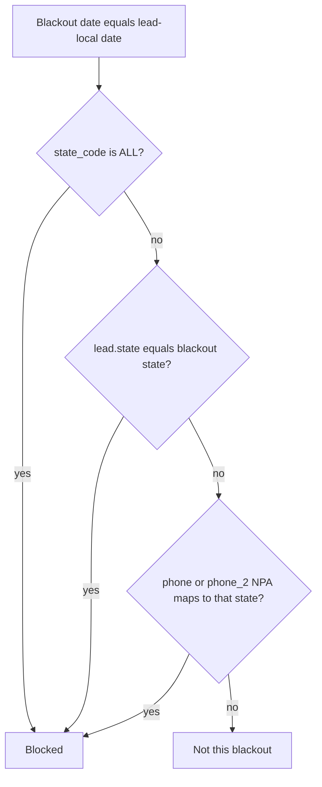

# State and area-code blackout dates

## Admin input: state only

You do **not** add individual area codes. The form is date, state (or All states), and optional label.

Picking **CA** means the system automatically treats **every US area code assigned to California** as in-scope. There is no NPA picker, no comma-separated codes, and no extra column on the blackout row.

## Behavior

Today [`BlackoutDate`](app/Models/BlackoutDate.php) is company-wide only. [`ComplianceService::isBlackedOut()`](app/Services/Compliance/ComplianceService.php) matches **date**, then every lead is blocked.

New rule for a dated blackout:

- **All states** — same as today: every lead is blocked that local calendar day. Area codes are irrelevant.
- **One state** (e.g. CA) — blocked if **either**:
  - `lead.state` is that state, **or**
  - `phone` or `phone_2` has an area code that belongs to that state (looked up from a built-in NPA map, not from anything the admin typed).

That is the double-cover: a CA holiday still stops a NY-address lead with a 310 number, and a CA-address lead with a 212 number is still stopped via state. Inventory, next-lead, callbacks, and dashboard forecasts already go through `isWithinLegalWindow()` / `legalWindowOnLocalDate()`, so they pick this up with no extra wiring.

## Data model

Add `state_code` to `blackout_dates` (default `ALL` so existing rows stay company-wide).

- Drop unique `(company_id, date)` in [`database/migrations/2026_08_10_000013_create_blackout_dates_table.php`](database/migrations/2026_08_10_000013_create_blackout_dates_table.php) via a new migration.
- Add unique `(company_id, date, state_code)` so the same date can exist once per state (CA holiday and NY holiday on the same day).
- Sentinel `ALL` (not null) so SQLite and Postgres unique indexes both work.

No area-code column and no area-code UI. NPAs come only from the selected state via a static map.

## Area-code map

Add [`app/Support/NpaToState.php`](app/Support/NpaToState.php) (or similar): NPA string → 2-letter state. Use it from `BlackoutDate` matching, not the other way around.

- Cover assigned US NPAs (50 states + DC). Skip Canadian/Caribbean codes so they never match a US state blackout.
- Map each NPA to its **primary** state (overlays stay in one state; that is the conservative intent).
- Resolve NPA with existing [`PhoneNormalizer`](app/Support/PhoneNormalizer.php) (10 digits, strip leading `1`).

## Admin UI

Update Filament blackout form/table:

- [`BlackoutDateForm`](app/Filament/Resources/BlackoutDates/Schemas/BlackoutDateForm.php): required state select — **All states** plus US states. **No area-code field.** Helper text: choosing a state also blocks every area code for that state, even when `lead.state` differs. Unique on date scoped by `company_id` + `state_code` (same pattern as [`LeadTypeForm`](app/Filament/Resources/LeadTypes/Schemas/LeadTypeForm.php)).
- [`BlackoutDatesTable`](app/Filament/Resources/BlackoutDates/Tables/BlackoutDatesTable.php): State column (`All states` vs `CA`), filter by state, default sort by date.

## Enforcement

On [`BlackoutDate`](app/Models/BlackoutDate.php): `appliesTo(Lead $lead): bool` (ALL, or state match, or either phone’s NPA → state).

[`ComplianceService::isBlackedOut()`](app/Services/Compliance/ComplianceService.php) becomes: same local date **and** `appliesTo($lead)`.

Missing state + unknown/non-US NPA: not blocked by a state-scoped blackout (only `ALL` hits them).

## Tests

- [`tests/Feature/ComplianceServiceTest.php`](tests/Feature/ComplianceServiceTest.php):
  - `ALL` still blocks every state.
  - CA blackout blocks a CA lead with a NY area code (state hit).
  - CA blackout blocks a NY lead with a 310 number (NPA hit).
  - CA blackout does **not** block a NY lead with a NY area code.
  - `phone_2` NPA alone is enough to block.
- Filament create test: same date allowed for CA and NY; duplicate CA + date fails unique.

## Out of scope

- Any admin UI or storage for individual area codes.
- Standalone “these area codes only, no state” blackouts.
- ZIP/metro scopes.
- Changing `StateRule` hours (still state-only).
