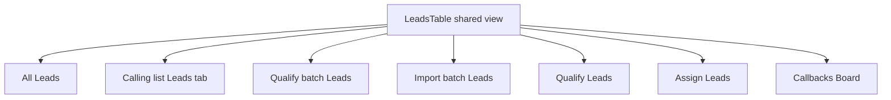

# Unified lead table

Too many lead lists feel like different apps. There will be **one table view** — the same search, column picker, filters, pagination, row actions, and bulk actions — used everywhere a list of leads appears. Screens differ only by **which leads are queried** and **which columns (and a couple of filters) start on**. Every column can be turned off, and each user saves their own layout **per screen**.

This is not a shared column catalog with leftover custom tables.

## What is the same on every screen

One builder: `app/Filament/Resources/Leads/Tables/LeadsTable.php`.

- **Search** on phone, names, state, external ID (and other searchable columns already on All Leads)
- **Column picker** (`toggleable`) with the full field set available on every screen
- **Filters** — one set, the union of All Leads + Qualify/Assign pool + batch check filters. The toolbar filter icon opens that set stacked **vertically** (dropdown, one column). Labels stay consistent (Start Date / End Date, Calling list, Last Disp, …)
- **Pagination** `[10, 25, 50, 100]`, default 25
- **Row action** — same as All Leads today: `ViewAction` to the lead view page
- **Bulk actions** — Recycle, Mark DNC, Move to list, Merge, re-run Soft Score / RND / Qualification / DNC
- **Reassign** — available on any callback lead (so Callbacks Board is not a special table)

Call Detail, dashboard totals modal, Import duplicates, and Lead Histories stay out of scope (not lead grids).

## What is allowed to differ (presets)

`LeadTablePreset` (`AllLeads`, `CallingList`, `Batch`, `Qualify`, `Assign`, `Callbacks`):

- **Starter columns** — first visit only, until the user saves a layout for that screen
- **Default sort**
- **Query scope** (all company leads, this calling list, this batch, callbacks only, assignable-only for Assign)
- **Default filter values** on Qualify/Assign only, so those pages still open on **Holding + standard** (and qualified-partners match `InList`). All Leads stays unfiltered.

Qualify batch keeps the `leads.id` sort workaround (belongsToMany join). Each screen uses its own column-layout key so All Leads and Qualify batch never share one saved set.

### Starter columns (first visit)

- **Batch:** ID, phone, names, status, Soft score, RND, Qualification, DNC, Booking, Error
- **All Leads / Calling List:** today's All Leads defaults (Calling List still omits List)
- **Qualify / Assign:** today's pool defaults (phone, names, state, status, last disp, attempts, imported_at; partners/venue/event available)
- **Callbacks:** phone, name, callback time, owner, list, owner active

### Column picker and saved layout per screen

Nothing is locked on. Phone, ID, and every other starter field are `toggleable()` so you can hide them.

- **First visit** to a screen uses that screen's starter set (`isToggledHiddenByDefault` for the rest).
- **Changing the picker saves that user's default for that screen only.** Qualify batch layout does not change All Leads, and another user still sees the starter set until they change theirs.
- Store the saved layout on the user (JSON keyed by screen/preset), not only the PHP session, so it survives logout and a new browser. Filament's session persist stays as a cache.
- Column manager **reset** restores that screen's coded starter set and clears the saved user layout for that screen.

## Page chrome that is not the table

These stay **above** the shared table. They are why the page exists, not a second lead UI.

- **Qualify Leads:** matching-count banner + Checks form + Qualify button + Max Count. Selection = current table filters/search (`getFilteredTableQuery()`), not a separate filter form.
- **Assign Leads:** matching-count banner + target list + Max Count + Assign. Same table-as-selection.
- **Batch view:** existing batch overview / retry actions. Leads at the bottom are `LeadsTable`, not a read-only mini table. Do not attach/detach from the relation; lead bulk actions are allowed.
- **Callbacks Board:** no extra chrome; it is All Leads with `status = Callback`.

Qualify/Assign services take `HoldingFilter` built from table filter state via `LeadTableFilterMapper`. Preview and action use the same query the table shows.

## Tests and check

- `AssignLeadsTest` and `QualifyLeadsTest`: set **table filters** instead of `filterForm`
- `QualifyBatchTest` / `ViewCallingListTest` / `LeadsTableTest`: records still visible; column picker present
- Browser: All Leads, Qualify batch leads, Qualify Leads, Callbacks Board — same toolbar; starter columns differ; hide a starter column and confirm it stays off after reload on that screen only; reset restores the starter set
